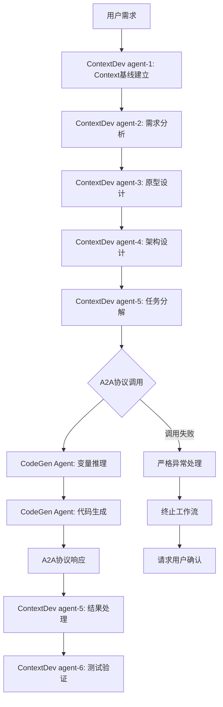

# A2A 协议：ContextDev 与 CodeGen 系统集成

## 📋 概述

本文档介绍 JeecgBoot 项目中两套互补的 AI Agent 系统通过 Agent-to-Agent (A2A)协议实现的深度集成方案。

## 🧠 ContextDev AI 编程方法论系统

### 核心功能

**ContextDev**是基于 Context Engineering 和 Chain of Thought 推理理论的 AI 原生开发方法论系统，专为 JeecgBoot 3.8.1+框架设计。

### 6-Agent 协作链

```
agent-1 (Context基线师) → agent-2 (需求推理师) → agent-3 (设计思考师)
     ↓                        ↓                      ↓
agent-6 (验证推理师) ← agent-5 (实施推理师) ← agent-4 (架构推理师)
```

**完整开发生命周期**：

- **agent-1**: Context 基线建立 + 领域知识构建 + 上下文管理
- **agent-2**: EARS 需求分析 + BDD 场景设计 + 业务推理
- **agent-3**: 需求可视化 + 交互设计推理 + 原型生成
- **agent-4**: 技术架构推理 + 设计决策链 + 组件设计
- **agent-5**: 任务分解推理 + 代码生成策略 + 实施推理
- **agent-6**: 测试策略推理 + 质量保证 + 验证设计

## ⚡ CodeGen 代码生成系统

### 核心功能

**CodeGen**是专业的 JeecgBoot 代码生成系统，基于官方 API 实现前后端 CRUD 代码自动生成，避免重复开发。

### 三核心变量系统

| 变量层级 | 变量名称        | 定义               | 示例                        |
| -------- | --------------- | ------------------ | --------------------------- |
| 第一层   | MODULE_NAME     | 模块名/系统名称    | finance, hrms               |
| 第二层   | SUBMODULE_NAME  | 子模块名/系统模块  | invoice, employee           |
| 第三层   | BUSINESS_ENTITY | 业务实体语义标识符 | InvoiceHeader, EmployeeInfo |

### 自动化能力

- **智能推理**: 从自然语言需求自动提取三核心变量
- **配置生成**: 自动生成符合 JeecgBoot 规范的 JSON 配置
- **代码生成**: 一键生成完整的 CRUD 功能模块
- **质量保证**: 标准化的代码结构和规范

## 🔗 A2A 协议集成架构

### 集成原理

通过 Agent-to-Agent 协议，实现 ContextDev 系统性方法论与 CodeGen 具体代码生成的无缝协作。

### 集成流程图



### 核心集成点

**1. 数据映射转换**

```yaml
# ContextDev架构信息 → CodeGen三核心变量
系统模块: "电商系统" → MODULE_NAME: "ecommerce"
功能模块: "产品管理" → SUBMODULE_NAME: "product"
领域对象: "ProductInfo" → BUSINESS_ENTITY: "ProductInfo"
```

**2. A2A 协议通信**

```yaml
# 请求格式
a2a_request:
  source_agent: "code-developer"
  target_agent: "codegen-expert"
  payload:
    system_context: { ... }
    generation_requirements: [...]

# 响应格式
a2a_response:
  execution_status: "Pass/Fail"
  generation_results: [...]
  post_generation_tasks: [...]
```

**3. 严格异常处理**

- **失败即停止**: A2A 协议调用失败时立即终止 6-Agent 工作流
- **用户确认**: 必须请求用户明确确认后才能继续
- **禁止降级**: 不允许自动生成手动开发的 CRUD 代码

## 🚀 集成价值和效益

### 开发效率提升

- **代码生成覆盖率**: 70-80%的基础功能自动生成
- **开发时间节省**: 基础 CRUD 功能开发时间减少 80%
- **质量保证**: 统一的代码风格和架构模式

### 智能协作优势

- **无缝集成**: Agent 间自动化协作，减少人工干预
- **智能决策**: 基于架构复杂度自动选择生成策略
- **完整追溯**: 从需求分析到代码生成的完整质量追踪

### 风险控制机制

- **严格异常处理**: A2A 协议失败时的严格停止策略
- **质量保证**: 完整的测试验证和质量控制流程
- **用户控制**: 关键决策点的用户确认机制

## 📊 集成工作流程

### 标准协作流程

1. **需求理解阶段**: agent-1 到 agent-2 完成需求分析和基线建立
2. **设计阶段**: agent-3 到 agent-4 完成原型设计和架构设计
3. **A2A 集成阶段**: agent-5 通过 A2A 协议调用 CodeGen 进行代码生成
4. **验证阶段**: agent-6 完成测试设计和质量验证

### 异常处理流程

1. **A2A 协议调用失败** → 立即终止 6-Agent 工作流
2. **错误信息透明化** → 向用户完整报告失败原因
3. **用户确认机制** → 等待用户明确确认后续操作
4. **工作流暂停** → 在用户确认前暂停所有后续处理

## 🎯 适用场景

### 最佳适用场景

- **企业级应用开发**: 需要标准化开发流程的中大型项目
- **快速原型开发**: 需要快速验证业务概念的项目
- **团队协作项目**: 需要统一开发标准的多人协作项目

### 技术要求

- **JeecgBoot 3.8.1+**: 确保框架兼容性
- **完整需求**: 明确的业务需求和技术约束
- **标准环境**: 配置完整的 JeecgBoot 开发环境

## 📚 详细文档

### 系统文档位置

- **ContextDev 系统**: `ContextDev/README.md` - AI 编程方法论详细说明
- **CodeGen 系统**: `CodeGen/README.md` - 代码生成系统使用指南
- **A2A 协议指南**: `ContextDev/A2A_Protocol_Guide.md` - 协议规范、集成实施和使用说明
- **测试场景指南**: `ContextDev/TEST_SCENARIO_GUIDE.md` - 测试场景配置和使用说明

## 🚀 上手指南

### 快速开始

本章节提供 A2A 协议、ContextDev 系统和 CodeGen 系统三方协作的具体使用场景和操作指南。

### EXECUTION_MODE 参数说明

ContextDev 6-Agent 协作链支持两种执行模式：

- **interactive 模式**: 交互式模式，每个 Agent 在执行前后都需要用户确认
- **silent 模式**: 静默模式，AI 根据专家经验和行业最佳实践自动完成整个需求闭环开发

**参数传递机制**: EXECUTION_MODE 参数在整个 6-Agent 协作链中保持一致，由 agent-1 设置后传递给后续所有 Agent。

### 场景 1：探索式需求分析场景（silent 模式）

**适用情况**: 需求不明确，需要通过 AI 协作逐步明确需求的情况
**执行模式**: silent 模式 - AI 自动完成整个需求闭环开发

#### 对话式操作步骤

**步骤 1: 启动基线管理师**

```
@baseline-manager 我需要开发一个企业管理系统，但具体需求还不清楚。

业务领域：企业管理
初始描述：我们需要一个管理系统，但具体需求还不清楚
利益相关者：业务用户、管理员
技术约束：使用JeecgBoot框架，支持移动端
```

**预期输出**: Context 基线和领域知识框架

**步骤 2: 需求分析**

```
@requirements-analyst 基于基线管理师的输出，请帮我分析具体的业务需求。

请使用EARS方法进行需求分析，并设计BDD场景。
```

**预期输出**: 结构化需求文档和 BDD 测试场景

**步骤 3: 原型设计**

```
@prototype-designer 基于需求分析结果，请设计系统原型。

重点关注用户界面和交互流程。
```

**预期输出**: 原型设计和用户体验方案

**步骤 4: 架构设计**

```
@system-architect 基于原型设计，请设计系统架构。

使用JeecgBoot框架，确保架构的可扩展性和可维护性。
```

**预期输出**: 技术架构方案和组件设计

**步骤 5: 代码开发**

```
@code-developer 基于架构设计，请通过A2A协议调用CodeGen生成代码。

确保生成的代码符合JeecgBoot规范。
```

**预期输出**: 完整的 CRUD 代码和数据库脚本

#### 预期输出

- **需求文档**: 从模糊描述到结构化需求的完整转换
- **架构设计**: 基于明确需求的技术架构方案
- **代码生成**: 通过 A2A 协议生成的基础 CRUD 代码
- **实施计划**: 详细的开发任务分解和时间安排

#### 注意事项

- **迭代过程**: 探索式场景可能需要多轮迭代才能明确需求
- **用户参与**: 建议在需求明确过程中保持与业务用户的沟通
- **灵活调整**: 根据探索结果随时调整技术方案和实施策略

#### 故障排除

- **需求发散**: 如果需求过于发散，使用 Agent-1 重新建立更聚焦的基线
- **技术约束冲突**: 及时调整技术约束，确保方案可行性
- **A2A 调用失败**: 检查 CodeGen 服务状态，必要时转为手动开发

### 场景 2：明确需求实施场景（interactive 模式）

**适用情况**: 需求已明确，直接进行代码生成和实施的情况
**执行模式**: interactive 模式 - 每个 Agent 执行前后都需要用户确认

#### 对话式操作步骤

**步骤 1: 直接架构设计**

```
@system-architect 我有明确的需求，请直接设计系统架构。

系统名称：培训管理系统课程信息管理
业务领域：企业培训管理
核心实体：
- CourseInfo（课程信息）
  - courseName（课程名称）
  - courseType（课程类型）
  - duration（课程时长）
  - instructor（讲师）
  - description（课程描述）

技术要求：使用JeecgBoot框架，MySQL数据库
```

**预期输出**: 技术架构方案和数据库设计

**步骤 2: 代码生成**

```
@code-developer 基于架构设计，请通过A2A协议调用CodeGen生成代码。

模块名称：training
子模块：course
业务实体：CourseInfo
确保生成完整的CRUD功能。
```

**预期输出**: 完整的后端代码（Controller、Service、Entity、Mapper）和前端代码

**步骤 3: 质量验证**

```
@quality-tester 请验证生成的代码质量。

检查项目：
- 代码规范符合性
- JeecgBoot框架兼容性
- 数据库表结构正确性
- API接口功能完整性
```

**预期输出**: 质量评估报告和改进建议

#### 预期输出

- **代码文件**: 完整的后端 Java 文件（Controller、Service、Entity、Mapper）
- **前端文件**: Vue 组件文件（List、Form、Modal）
- **数据库脚本**: DDL 脚本和索引创建语句
- **配置文件**: 相关的配置和路由文件

#### 注意事项

- **需求完整性**: 确保输入的需求信息完整且准确
- **环境一致性**: 确保开发环境与目标部署环境一致
- **代码审查**: 生成的代码需要进行人工审查和测试

#### 故障排除

- **A2A 协议超时**: 检查网络连接和服务响应时间
- **代码生成失败**: 查看 CodeGen 服务日志，检查 JeecgBoot API 状态
- **文件冲突**: 检查目标目录是否存在同名文件
- **编译错误**: 验证生成的代码语法和依赖项

### 通用故障排除指南

#### 环境问题

```bash
# 检查服务状态
systemctl status jeecg-boot  # Linux
netstat -an | findstr :8080  # Windows

# 检查端口占用
lsof -i :8080  # macOS/Linux
netstat -ano | findstr :8080  # Windows
```

#### A2A 协议问题

```python
# 测试A2A连接
import requests

try:
    response = requests.get("http://localhost:8888/health", timeout=5)
    print(f"CodeGen A2A服务状态: {response.status_code}")
except Exception as e:
    print(f"连接失败: {e}")
```

#### 配置问题

```bash
# 验证配置文件
python CodeGen/Code_Gen_Guide.py --validate-config

# 检查环境变量
echo $JEECG_PROJECT_ROOT  # Unix
echo %JEECG_PROJECT_ROOT%  # Windows
```

## 📞 技术支持

如遇问题，请检查：

1. **服务状态**：确认 JeecgBoot 和 CodeGen A2A 服务正常运行
2. **网络连接**：验证服务间网络连通性
3. **配置文件**：检查配置文件格式和内容正确性
4. **日志信息**：查看详细的错误日志和调试信息
5. **环境依赖**：确认所有依赖项正确安装和配置

---

**集成状态**: 设计完成，待技术实施  
**协议版本**: A2A-ContextDev-CodeGen-v1.0  
**更新日期**: 2025-08-05  
**兼容框架**: JeecgBoot 3.8.1+
