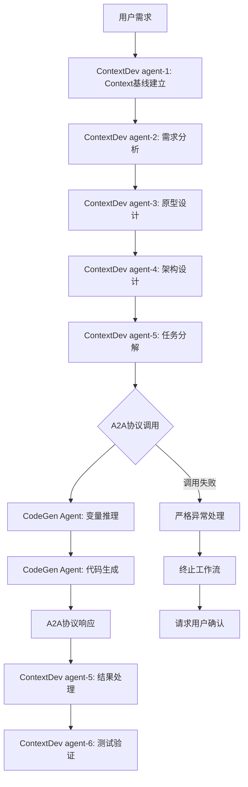

# A2A 协议：ContextDev 与 CodeGen 系统集成

## 📋 概述

本文档介绍 JeecgBoot 项目中两套互补的 AI Agent 系统通过 Agent-to-Agent (A2A)协议实现的深度集成方案。

## 🧠 ContextDev AI 编程方法论系统

### 核心功能

**ContextDev**是基于 Context Engineering 和 Chain of Thought 推理理论的 AI 原生开发方法论系统，专为 JeecgBoot 3.8.1+框架设计。

### 6-Agent 协作链

```
agent-1 (Context基线师) → agent-2 (需求推理师) → agent-3 (设计思考师)
     ↓                        ↓                      ↓
agent-6 (验证推理师) ← agent-5 (实施推理师) ← agent-4 (架构推理师)
```

**完整开发生命周期**：

- **agent-1**: Context 基线建立 + 领域知识构建 + 上下文管理
- **agent-2**: EARS 需求分析 + BDD 场景设计 + 业务推理
- **agent-3**: 需求可视化 + 交互设计推理 + 原型生成
- **agent-4**: 技术架构推理 + 设计决策链 + 组件设计
- **agent-5**: 任务分解推理 + 代码生成策略 + 实施推理
- **agent-6**: 测试策略推理 + 质量保证 + 验证设计

## ⚡ CodeGen 代码生成系统

### 核心功能

**CodeGen**是专业的 JeecgBoot 代码生成系统，基于官方 API 实现前后端 CRUD 代码自动生成，避免重复开发。

### 三核心变量系统

| 变量层级 | 变量名称        | 定义               | 示例                        |
| -------- | --------------- | ------------------ | --------------------------- |
| 第一层   | MODULE_NAME     | 模块名/系统名称    | finance, hrms               |
| 第二层   | SUBMODULE_NAME  | 子模块名/系统模块  | invoice, employee           |
| 第三层   | BUSINESS_ENTITY | 业务实体语义标识符 | InvoiceHeader, EmployeeInfo |

### 自动化能力

- **智能推理**: 从自然语言需求自动提取三核心变量
- **配置生成**: 自动生成符合 JeecgBoot 规范的 JSON 配置
- **代码生成**: 一键生成完整的 CRUD 功能模块
- **质量保证**: 标准化的代码结构和规范

## 🔗 A2A 协议集成架构

### 集成原理

通过 Agent-to-Agent 协议，实现 ContextDev 系统性方法论与 CodeGen 具体代码生成的无缝协作。

### 集成流程图



### 核心集成点

**1. 数据映射转换**

```yaml
# ContextDev架构信息 → CodeGen三核心变量
系统模块: "电商系统" → MODULE_NAME: "ecommerce"
功能模块: "产品管理" → SUBMODULE_NAME: "product"
领域对象: "ProductInfo" → BUSINESS_ENTITY: "ProductInfo"
```

**2. A2A 协议通信**

```yaml
# 请求格式
a2a_request:
  source_agent: "ContextDev-agent-5"
  target_agent: "codegen-expert"
  payload:
    system_context: { ... }
    generation_requirements: [...]

# 响应格式
a2a_response:
  execution_status: "Pass/Fail"
  generation_results: [...]
  post_generation_tasks: [...]
```

**3. 严格异常处理**

- **失败即停止**: A2A 协议调用失败时立即终止 6-Agent 工作流
- **用户确认**: 必须请求用户明确确认后才能继续
- **禁止降级**: 不允许自动生成手动开发的 CRUD 代码

## 🚀 集成价值和效益

### 开发效率提升

- **代码生成覆盖率**: 70-80%的基础功能自动生成
- **开发时间节省**: 基础 CRUD 功能开发时间减少 80%
- **质量保证**: 统一的代码风格和架构模式

### 智能协作优势

- **无缝集成**: Agent 间自动化协作，减少人工干预
- **智能决策**: 基于架构复杂度自动选择生成策略
- **完整追溯**: 从需求分析到代码生成的完整质量追踪

### 风险控制机制

- **严格异常处理**: A2A 协议失败时的严格停止策略
- **质量保证**: 完整的测试验证和质量控制流程
- **用户控制**: 关键决策点的用户确认机制

## 📊 集成工作流程

### 标准协作流程

1. **需求理解阶段**: agent-1 到 agent-2 完成需求分析和基线建立
2. **设计阶段**: agent-3 到 agent-4 完成原型设计和架构设计
3. **A2A 集成阶段**: agent-5 通过 A2A 协议调用 CodeGen 进行代码生成
4. **验证阶段**: agent-6 完成测试设计和质量验证

### 异常处理流程

1. **A2A 协议调用失败** → 立即终止 6-Agent 工作流
2. **错误信息透明化** → 向用户完整报告失败原因
3. **用户确认机制** → 等待用户明确确认后续操作
4. **工作流暂停** → 在用户确认前暂停所有后续处理

## 🎯 适用场景

### 最佳适用场景

- **企业级应用开发**: 需要标准化开发流程的中大型项目
- **快速原型开发**: 需要快速验证业务概念的项目
- **团队协作项目**: 需要统一开发标准的多人协作项目

### 技术要求

- **JeecgBoot 3.8.1+**: 确保框架兼容性
- **完整需求**: 明确的业务需求和技术约束
- **标准环境**: 配置完整的 JeecgBoot 开发环境

## 📚 详细文档

### 系统文档位置

- **ContextDev 系统**: `ContextDev/README.md` - AI 编程方法论详细说明
- **CodeGen 系统**: `CodeGen/README.md` - 代码生成系统使用指南
- **A2A 协议规范**: `ContextDev/A2A_Protocol_Specification.md` - 完整协议规范
- **集成实施指南**: `ContextDev/A2A_Integration_Guide.md` - 技术实施细节

### 快速开始

1. 阅读各系统的 README 文档了解基础功能
2. 查看 A2A 协议规范了解集成机制
3. 参考集成实施指南进行技术实施
4. 按照 ContextDev 的 6-Agent 协作链执行开发流程

---

**集成状态**: 设计完成，待技术实施  
**协议版本**: A2A-ContextDev-CodeGen-v1.0  
**更新日期**: 2025-08-05  
**兼容框架**: JeecgBoot 3.8.1+
