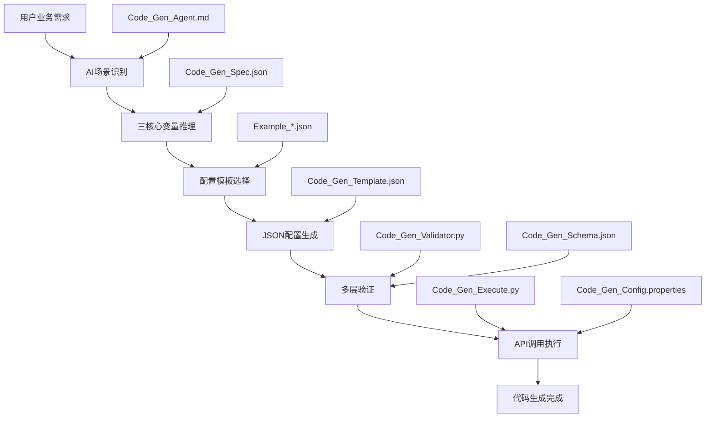

# JeecgBoot CodeGen 代码生成系统

## 📋 系统概述

JeecgBoot CodeGen 是一个企业级的智能代码生成系统，通过 AI 驱动的"需求理解 → 配置生成 → 代码生成"工作流，将自然语言业务需求转化为完整的 JeecgBoot CRUD 功能模块。系统采用标准化配置、多层验证和自动化执行的架构设计，确保生成代码的质量和一致性。

### 🎯 核心能力

- **智能场景识别**: 自动识别独立表和主子表关联场景，选择最优的代码生成策略
- **三核心变量系统**: 基于 MODULE_NAME、SUBMODULE_NAME、BUSINESS_ENTITY 的标准化命名体系
- **多场景支持**: 完整支持独立表、主表、子表三种业务场景的代码生成
- **配置驱动**: 通过标准化 JSON 配置文件驱动整个代码生成流程
- **质量保证**: 多层次验证机制确保配置正确性和 API 调用成功率
- **自动化集成**: 一键完成代码生成、前端迁移、数据库同步和模块集成
- **标准化架构**: 清晰的文件职责分离和统一的接口规范

## 📁 系统架构

### 核心组件架构图

```
┌─────────────────────────────────────────────────────────────────┐
│                    JeecgBoot CodeGen 系统                        │
├─────────────────────────────────────────────────────────────────┤
│  🤖 AI代理层                                                     │
│  ├── Code_Gen_Agent.md          # AI代理规范和行为定义           │
│  └── 三核心变量推理系统          # MODULE_NAME/SUBMODULE_NAME/   │
│                                 # BUSINESS_ENTITY               │
├─────────────────────────────────────────────────────────────────┤
│  📋 配置管理层                                                   │
│  ├── Code_Gen_Config.properties # 系统配置和API接口             │
│  ├── Code_Gen_Spec.json         # AI友好的增强规范              │
│  ├── Code_Gen_Template.json     # 可执行配置模板                │
│  ├── Example_Independent_Table.json # 独立表标准示例            │
│  └── Example_Main_Sub_Table.json    # 主子表标准示例            │
├─────────────────────────────────────────────────────────────────┤
│  ✅ 验证保障层                                                   │
│  ├── Code_Gen_Schema.json       # JSON结构验证模式              │
│  └── Code_Gen_Validator.py      # 核心验证逻辑                  │
├─────────────────────────────────────────────────────────────────┤
│  ⚡ 执行引擎层                                                   │
│  ├── Code_Gen_Execute.py        # 核心执行器                    │
│  └── JeecgBoot API调用          # 登录→创建→同步→生成           │
├─────────────────────────────────────────────────────────────────┤
│  📚 支持服务层                                                   │
│  ├── Code_Gen_DICT.json         # 数据字典缓存                  │
│  ├── requirements.txt           # Python依赖管理                │
│  └── README.md                  # 系统文档                      │
└─────────────────────────────────────────────────────────────────┘
```

### 文件职责定义

#### 🤖 AI 代理与规范层

**Code_Gen_Agent.md** - AI 代理规范文档

- 定义 AI 代理的行为边界和推理策略
- 包含场景识别逻辑（独立表 vs 主子表）
- 规范三核心变量的推理和提取规则
- 协调整个代码生成工作流的执行

#### 📋 配置管理层

**Code_Gen_Config.properties** - 系统配置文件

- JeecgBoot API 接口地址配置
- 超时时间和重试策略设置
- 编译和前端迁移配置
- 权限授权和路径配置
- **注意**：核心的8个环境变量不再从此文件读取

**Code_Gen_Spec.json** - AI 友好的增强规范

- 三核心变量系统的完整定义
- 字段长度限制和验证规则
- 业务规则和命名规范
- AI 推理策略和常见错误预防

**Code_Gen_Template.json** - 可执行配置模板

- 标准表单配置模板结构
- 系统字段和字段模板定义
- 变量占位符和替换规则
- JeecgBoot API 参数映射

**Example_Independent_Table.json** - 独立表标准示例

- 完整的独立表配置参考
- 展示标准的字段配置和系统字段
- tableType=1 的标准实现

**Example_Main_Sub_Table.json** - 主子表标准示例

- 完整的主子表配置参考
- 展示 subList 数组和关联配置
- tableType=2 的标准实现

#### ✅ 验证保障层

**Code_Gen_Schema.json** - JSON 结构验证模式

- 基于 JSON Schema 的结构验证
- 字段类型和长度限制定义
- 必需字段和可选字段规范
- 支持独立表和主子表场景

**Code_Gen_Validator.py** - 核心验证器

- orderNum 连续性验证（防止 API 失败）
- 系统字段完整性验证
- 表名格式和命名规范验证
- subList 配置完整性验证

#### ⚡ 执行引擎层

**Code_Gen_Execute.py** - 核心执行器

- 完整的 JeecgBoot API 调用流程
- 支持独立表、主表、子表三种场景
- 集成配置验证和错误处理
- 自动化前端代码迁移功能

#### 📚 支持服务层

**Code_Gen_DICT.json** - 数据字典缓存

- 系统数据字典的本地缓存
- 字段类型和选项值定义
- 减少 API 调用提升性能

**requirements.txt** - Python 依赖管理

- 系统运行所需的 Python 包
- 版本锁定确保环境一致性

## 🎯 支持的业务场景

### 场景 1：独立表（Single Table）

**适用情况**：无关联关系的独立业务实体

- 客户信息管理、产品目录、用户档案等
- 配置参数：`tableType: 1, relationType: null, tabOrderNum: null`
- 参考示例：`Example_Independent_Table.json`

### 场景 2：主子表（Master-Detail Table）

**适用情况**：存在 1 对多关联关系的业务实体

- 订单-订单明细、学生-成绩记录、项目-任务列表等
- 主表配置：`tableType: 2, relationType: null, tabOrderNum: null`
- 子表配置：`tableType: 3, relationType: 0, tabOrderNum: 1,2,3...`
- 参考示例：`Example_Main_Sub_Table.json`

## 🔄 核心工作流程

### 工作流程图



### 详细执行步骤

#### 步骤 1：AI 需求理解

- **输入**：自然语言业务需求
- **处理**：基于`Code_Gen_Agent.md`的推理策略
- **输出**：场景识别结果（独立表/主子表）

#### 步骤 2：三核心变量推理

- **依据**：`Code_Gen_Spec.json`中的推理规则
- **提取**：MODULE_NAME、SUBMODULE_NAME、BUSINESS_ENTITY
- **验证**：命名规范和业务合理性

#### 步骤 3：配置模板选择

- **独立表场景**：参考`Example_Independent_Table.json`
- **主子表场景**：参考`Example_Main_Sub_Table.json`
- **模板应用**：基于`Code_Gen_Template.json`生成配置

#### 步骤 4：配置验证

- **结构验证**：`Code_Gen_Schema.json`进行 JSON Schema 验证
- **业务验证**：`Code_Gen_Validator.py`进行核心逻辑验证
- **关键检查**：orderNum 连续性、系统字段完整性、表名格式

#### 步骤 5：代码生成执行

```bash
python3 Code_Gen_Execute.py PROJECT_PATH MODULE_NAME SUBMODULE_NAME BUSINESS_ENTITY

# 示例：生成客户信息管理模块
python3 Code_Gen_Execute.py /Users/admin/Work/Github/JeecgBoot crm customer CustomerInfo
```

- **API 调用**：登录 → 创建表单 → 数据库同步 → 代码生成
- **自动化处理**：前端代码迁移、模块集成
- **结果输出**：完整的 CRUD 功能模块

## 📊 三核心变量系统

### 变量定义与规范

| 变量层级   | 变量名称        | 格式要求   | 作用         | 示例                                     |
| ---------- | --------------- | ---------- | ------------ | ---------------------------------------- |
| **第一层** | MODULE_NAME     | lowercase  | 业务模块标识 | crm, finance, education                  |
| **第二层** | SUBMODULE_NAME  | lowercase  | 子模块标识   | customer, invoice, student                   |
| **第三层** | BUSINESS_ENTITY | PascalCase | 业务实体名称 | CustomerInfo, InvoiceHeader, StudentInfo |

### 派生变量规则

```
TABLE_NAME = us_{MODULE_NAME}_{SUBMODULE_NAME}_{BUSINESS_ENTITY.toLowerCase()}
PACKAGE_NAME = org.jeecg.modules.{MODULE_NAME}.{SUBMODULE_NAME}
FRONTEND_PATH = {MODULE_NAME}/{SUBMODULE_NAME}/{BUSINESS_ENTITY}
```

### 命名示例

**独立表场景**：

```
用户需求: "客户信息管理系统"
MODULE_NAME: crm
SUBMODULE_NAME: customer
BUSINESS_ENTITY: CustomerInfo
TABLE_NAME: us_crm_customer_customerinfo
```

**主子表场景**：

```
用户需求: "学生信息管理，包含教育经历和获奖记录"
主表: education/student/StudentInfo
子表1: education/student/EducationHistory
子表2: education/student/AwardRecord
```

## 🚀 快速开始指南

### 环境准备

#### 1. 系统要求

- Python 3.8+
- JeecgBoot 3.x 运行环境
- MySQL/PostgreSQL 数据库

#### 2. 依赖安装

```bash
cd CodeGen
pip install -r requirements.txt
```

#### 3. 必需环境变量设置

**⚠️ 重要提醒：以下8个环境变量是系统运行的必需条件，缺少任何一个都会导致程序直接退出。**

```bash
# JeecgBoot 项目和服务器配置（必需）
export JEECG_PROJECT_ROOT=/Users/admin/Work/Github/JeecgBoot
export JEECG_BASE_URL=http://localhost:8080/jeecg-boot
export JEECG_USERNAME=admin
export JEECG_PASSWORD=123456

# 数据库连接配置（必需）
export JEECG_DATABASE_TYPE=mysql
export JEECG_DATABASE_URL=jdbc:mysql://localhost:30004/jeecg-boot
export JEECG_DATABASE_USERNAME=root
export JEECG_DATABASE_PASSWORD=Best@2008
```

**环境变量说明：**

| 环境变量 | 必需性 | 说明 | 示例值 |
|---------|-------|------|--------|
| `JEECG_PROJECT_ROOT` | ✅ **必需** | JeecgBoot项目根目录绝对路径 | `/Users/admin/Work/Github/JeecgBoot` |
| `JEECG_BASE_URL` | ✅ **必需** | JeecgBoot后端服务基础URL | `http://localhost:8080/jeecg-boot` |
| `JEECG_USERNAME` | ✅ **必需** | JeecgBoot管理员用户名 | `admin` |
| `JEECG_PASSWORD` | ✅ **必需** | JeecgBoot管理员密码 | `123456` |
| `JEECG_DATABASE_TYPE` | ✅ **必需** | 数据库类型 | `mysql`/`postgresql`/`oracle` |
| `JEECG_DATABASE_URL` | ✅ **必需** | 数据库连接URL | `jdbc:mysql://localhost:30004/jeecg-boot` |
| `JEECG_DATABASE_USERNAME` | ✅ **必需** | 数据库用户名 | `root` |
| `JEECG_DATABASE_PASSWORD` | ✅ **必需** | 数据库密码 | `Best@2008` |

**设置方法：**

1. **临时设置（当前会话）**：
```bash
# 直接在终端执行上述export命令
```

2. **永久设置（推荐）**：
```bash
# 添加到 ~/.bashrc 或 ~/.zshrc
echo 'export JEECG_PROJECT_ROOT=/Users/admin/Work/Github/JeecgBoot' >> ~/.bashrc
echo 'export JEECG_BASE_URL=http://localhost:8080/jeecg-boot' >> ~/.bashrc
# ... 添加其他7个变量

# 重新加载配置
source ~/.bashrc
```

3. **验证设置**：
```bash
# 检查所有必需环境变量
env | grep JEECG

# 测试程序启动（会立即检查环境变量）
python3 Code_Gen_Execute.py
```

### 使用示例

#### 示例 1：独立表生成

**需求**：创建客户信息管理功能

**执行步骤**：

1. **配置验证**：

```bash
python3 Code_Gen_Validator.py Example_Independent_Table.json
```

2. **代码生成**：

```bash
python3 Code_Gen_Execute.py /path/to/project crm customer CustomerInfo
```

**生成结果**：

- 后端代码：`jeecg-module-crm/`
- 前端代码：`jeecgboot-vue3/src/views/crm/customer/`
- 数据库表：`us_crm_customer_customerinfo`

#### 示例 2：主子表生成

**需求**：创建学生信息管理，包含教育经历子表

**执行步骤**：

1. **主表生成**：

```bash
python3 Code_Gen_Execute.py /path/to/project education student StudentInfo
```

2. **子表生成**：

```bash
python3 Code_Gen_Execute.py /path/to/project education student EducationHistory
```

**生成结果**：

- 主子表关联的完整 CRUD 功能
- 前端支持主子表编辑界面
- 数据库外键关联配置

### 验证与测试

#### 配置验证

```bash
# 验证独立表配置
python3 Code_Gen_Validator.py your_config.json

# 查看验证报告
python3 -c "
from Code_Gen_Validator import CodeGenValidator
validator = CodeGenValidator()
print(validator.generate_validation_report('your_config.json'))
"
```

#### 生成代码测试

1. **编译验证**：

```bash
cd /path/to/JeecgBoot
mvn clean compile -DskipTests
```

2. **功能测试**：

- 启动 JeecgBoot 应用
- 访问生成的功能模块
- 验证 CRUD 操作正常

## 🔧 高级配置

### 自定义字段模板

在 `Code_Gen_Template.json` 中可以自定义字段模板：

```json
{
  "constants": {
    "field_templates": {
      "custom_select": {
        "fieldShowType": "select",
        "dbType": "string",
        "dictTable": "sys_dict",
        "dictField": "dict_code",
        "dictText": "dict_name"
      }
    }
  }
}
```

### 环境变量配置

**系统采用环境变量优先的配置策略**：

- **核心配置**：8个必需环境变量完全来自环境变量，无默认值
- **其他配置**：通过 `Code_Gen_Config.properties` 提供默认值
- **配置优先级**：环境变量 > 配置文件默认值

**必需环境变量（详见"快速开始"章节）**：

```bash
# 这8个变量必须设置，程序启动时会检查
JEECG_PROJECT_ROOT, JEECG_BASE_URL, JEECG_USERNAME, JEECG_PASSWORD
JEECG_DATABASE_TYPE, JEECG_DATABASE_URL, JEECG_DATABASE_USERNAME, JEECG_DATABASE_PASSWORD
```

**缺失检查**：
- 程序启动时自动检查所有必需环境变量
- 任何变量缺失都会显示错误并立即退出
- 不再显示"环境变量覆盖"的日志信息

### 批量代码生成

支持批量生成多个模块：

```bash
# 创建批量配置文件
cat > batch_config.json << EOF
[
  {"module": "crm", "submodule": "customer", "entity": "CustomerInfo"},
  {"module": "product", "submodule": "catalog", "entity": "ProductInfo"},
  {"module": "order", "submodule": "management", "entity": "OrderInfo"}
]
EOF

# 批量执行
for config in $(cat batch_config.json | jq -r '.[] | @base64'); do
  _jq() { echo ${config} | base64 --decode | jq -r ${1}; }
  python3 Code_Gen_Execute.py $PROJECT_PATH $(_jq '.module') $(_jq '.submodule') $(_jq '.entity')
done
```

### 自定义验证规则

扩展 `Code_Gen_Validator.py` 添加自定义验证：

```python
def custom_business_validation(self, config: Dict) -> List[str]:
    """自定义业务验证规则"""
    errors = []
    # 添加您的验证逻辑
    return errors
```

## 🤖 AI 代理系统

### AI 职责边界

**✅ AI 负责的工作**：

- 自然语言需求理解和语义分析
- 三核心变量智能提取和推理
- 场景识别（独立表 vs 主子表）
- JSON 配置文件生成和验证
- 工作流程协调和执行

**❌ AI 严格禁止的行为**：

- 手动编写 SQL、Java、Vue 等代码文件
- 修改 JeecgBoot 框架的任何现有文件
- 跳过标准工作流程或配置验证步骤
- 直接操作数据库或文件系统

### 智能推理策略

- **语义分析优先**：基于业务本质而非关键词匹配
- **多维度评估**：从业务流程、管理对象、核心功能等维度分析
- **标准化输出**：确保生成的配置符合 JeecgBoot API 要求
- **质量保证**：通过多层验证确保配置正确性

## 📝 配置文件详解

### 系统配置 (`Code_Gen_Config.properties`)

**核心配置项**：

```properties
# 注意：核心的8个环境变量已移除，必须通过环境变量设置
# JEECG_PROJECT_ROOT, JEECG_BASE_URL, JEECG_USERNAME, JEECG_PASSWORD
# JEECG_DATABASE_TYPE, JEECG_DATABASE_URL, JEECG_DATABASE_USERNAME, JEECG_DATABASE_PASSWORD

# 数据库执行配置
database_execution.enabled=true
database_execution.method=mysql_client
database_execution.timeout=30
database_execution.auto_commit=true

# API超时配置
timeouts.login=10
timeouts.create=30
timeouts.sync=30
timeouts.codegen=60

# 代码生成配置
codegen.package_style=service
codegen.vue_style=vue3

# 前端代码迁移配置
frontend_migration.enabled=true
frontend_migration.target_base_path=jeecgboot-vue3/src/views
frontend_migration.cleanup_source=false
```

### 验证配置 (`Code_Gen_Schema.json`)

定义 JSON 配置的结构验证规则：

```json
{
  "$schema": "http://json-schema.org/draft-07/schema#",
  "properties": {
    "head": {
      "required": ["tableName", "business_entity", "tableType"]
    },
    "fields": {
      "type": "array",
      "minItems": 8
    }
  }
}
```

### 可执行配置模板 (`Code_Gen_Template.json`)

包含完整的表单配置模板：

```json
{
  "head": {
    "tableName": "{{TABLE_NAME}}",
    "business_entity": "{{BUSINESS_ENTITY}}",
    "tableType": "{{TABLE_TYPE}}"
  },
  "constants": {
    "system_fields": [
      "id",
      "create_by",
      "create_time",
      "update_by",
      "update_time",
      "sys_org_code",
      "del_flag"
    ],
    "field_templates": {
      "text": {
        "fieldShowType": "text",
        "dbType": "string",
        "isShowForm": "1",
        "isShowList": "1"
      }
    }
  }
}
```

## 🔍 故障排除

### 常见问题

#### 1. 环境变量缺失

**问题**：程序启动时提示"❌ 缺少必需的环境变量"
**解决**：

```bash
# 1. 检查当前环境变量设置
env | grep JEECG

# 2. 设置缺失的环境变量（参考快速开始章节）
export JEECG_PROJECT_ROOT=/your/project/path
export JEECG_BASE_URL=http://localhost:8080/jeecg-boot
# ... 设置其他6个变量

# 3. 验证设置成功
python3 Code_Gen_Execute.py
```

#### 2. API 调用失败

**问题**：登录失败或 API 超时
**解决**：

- 检查环境变量`JEECG_BASE_URL`、`JEECG_USERNAME`、`JEECG_PASSWORD`
- 确认 JeecgBoot 服务正常运行
- 验证网络连接和防火墙设置

#### 2. 配置验证失败

**问题**：orderNum 不连续或系统字段缺失
**解决**：

```bash
python3 Code_Gen_Validator.py your_config.json
```

根据验证报告修复配置问题

#### 3. 前端代码迁移失败

**问题**：生成的前端代码未正确迁移
**解决**：

- 检查项目路径配置
- 确认前端项目目录存在
- 手动执行迁移命令

### 调试模式

启用详细日志输出：

```bash
export CODEGEN_DEBUG=1
python3 Code_Gen_Execute.py ...
```

## 📚 参考资料

### 相关文档

- [JeecgBoot 官方文档](https://jeecg.com/)
- [JSON Schema 规范](https://json-schema.org/)
- [Python configparser 文档](https://docs.python.org/3/library/configparser.html)

### 示例项目

- `Example_Independent_Table.json` - 独立表配置示例
- `Example_Main_Sub_Table.json` - 主子表配置示例

### 技术支持

- 系统问题：检查配置文件和验证器输出
- 业务需求：参考 AI 代理规范文档
- 扩展开发：查看各组件的详细注释

---

**版本信息**：JeecgBoot CodeGen v3.0
**最后更新**：2025-01-04
**维护状态**：活跃开发中
