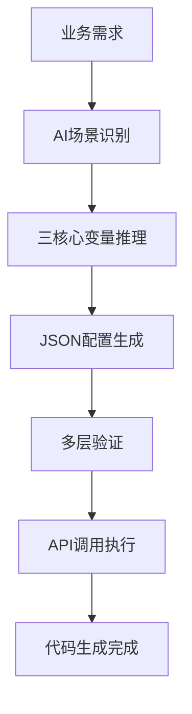

# JeecgBoot CodeGen 代码生成系统

## 系统概述

JeecgBoot CodeGen 是一个企业级智能代码生成系统，通过 AI 驱动的工作流将业务需求转化为完整的 JeecgBoot CRUD 功能模块。

**核心特性**：
- 智能场景识别：自动识别独立表和主子表场景
- 三核心变量系统：基于 MODULE_NAME、SUBMODULE_NAME、BUSINESS_ENTITY 的标准化命名
- 配置驱动：通过 JSON 配置文件驱动代码生成流程
- 多层验证：确保配置正确性和 API 调用成功率
- 自动集成：一键完成代码生成、前端迁移、数据库同步

## 快速开始

### 环境要求

- Python 3.8+
- JeecgBoot 3.x 运行环境
- MySQL/PostgreSQL 数据库

### 安装依赖

```bash
cd CodeGen
pip install -r requirements.txt
```

### 环境变量配置

**必需环境变量**（缺少任何一个都会导致程序退出）：

```bash
# JeecgBoot 配置
export JEECG_PROJECT_ROOT=/Users/admin/Work/Github/JeecgBoot
export JEECG_BASE_URL=http://localhost:8080/jeecg-boot
export JEECG_USERNAME=admin
export JEECG_PASSWORD=123456

# 数据库配置
export JEECG_DATABASE_TYPE=mysql
export JEECG_DATABASE_URL=jdbc:mysql://localhost:30004/jeecg-boot
export JEECG_DATABASE_USERNAME=root
export JEECG_DATABASE_PASSWORD=Best@2008
```

**设置方法**：
```bash
# 永久设置（推荐）
echo 'export JEECG_PROJECT_ROOT=/your/project/path' >> ~/.bashrc
# ... 添加其他7个变量
source ~/.bashrc

# 验证设置
env | grep JEECG
```

### 调用方式

系统支持4种调用方式：

**1. 标准代码生成**
```bash
python Code_Gen_Execute.py <配置文件.json>
```

**2. 环境配置向导**
```bash
python Code_Gen_Execute.py --setup-guide
```

**3. 环境检查**
```bash
python Code_Gen_Execute.py --check-env
```

**4. 数据字典下载**
```bash
python Code_Gen_Execute.py --dict
```

**推荐工作流程**：
```bash
python Code_Gen_Execute.py --setup-guide    # 1. 配置环境
python Code_Gen_Execute.py --check-env      # 2. 检查环境（可选）
python Code_Gen_Execute.py --dict           # 3. 下载数据字典（可选）
python Code_Gen_Execute.py config.json      # 4. 执行生成
```

## 三核心变量系统

### 变量定义

| 层级 | 变量名称 | 格式 | 作用 | 示例 |
|------|---------|------|------|------|
| 第一层 | MODULE_NAME | lowercase | 业务模块标识 | crm, finance, education |
| 第二层 | SUBMODULE_NAME | lowercase | 子模块标识 | customer, invoice, student |
| 第三层 | BUSINESS_ENTITY | PascalCase | 业务实体名称 | CustomerInfo, StudentInfo |

### 派生规则

```
TABLE_NAME = {MODULE_NAME}_{SUBMODULE_NAME}_{ENTITY_SUFFIX}
PACKAGE_NAME = org.jeecg.modules.{MODULE_NAME}.{SUBMODULE_NAME}
FRONTEND_PATH = {MODULE_NAME}/{SUBMODULE_NAME}/{BUSINESS_ENTITY}
```

**命名示例**：
```
需求: "客户信息管理系统"
MODULE_NAME: crm
SUBMODULE_NAME: customer
BUSINESS_ENTITY: CustomerProfile
TABLE_NAME: crm_customer_customerprofile
```

### 表名格式约束

**严格三段式要求**：
- 格式：`{MODULE_NAME}_{SUBMODULE_NAME}_{ENTITY_SUFFIX}`
- 段数：必须正好3段，不允许4段式
- 字符集：仅包含小写字母、数字、下划线

```bash
# 正确示例
crm_customer_profile
education_student_info
finance_invoice_header

# 错误示例（4段式）
crm_customer_customer_profile
education_student_student_info
```

## 支持的业务场景

### 独立表场景（tableType=1）
- 适用：无关联关系的独立业务实体
- 示例：客户信息管理、产品目录、用户档案
- 参考：`Example_Independent_Table.json`

### 主子表场景（tableType=2/3）
- 适用：存在1对多关联关系的业务实体
- 示例：订单-订单明细、学生-成绩记录
- 主表配置：`tableType: 2`
- 子表配置：`tableType: 3, tabOrderNum: 1,2,3...`
- 参考：`Example_Main_Sub_Table.json`

## 系统架构

### 核心组件

```
JeecgBoot CodeGen 系统
├── AI代理层
│   ├── Code_Gen_Agent.md          # AI代理规范
│   └── 三核心变量推理系统
├── 配置管理层
│   ├── Code_Gen_Config.properties # 系统配置
│   ├── Code_Gen_Spec.json         # AI增强规范
│   ├── Code_Gen_Template.json     # 配置模板
│   ├── Example_Independent_Table.json  # 独立表示例
│   └── Example_Main_Sub_Table.json     # 主子表示例
├── 验证保障层
│   ├── Code_Gen_Schema.json       # JSON结构验证
│   └── Code_Gen_Validator.py      # 核心验证逻辑
├── 执行引擎层
│   └── Code_Gen_Execute.py        # 核心执行器
└── 支持服务层
    ├── Code_Gen_DICT.json         # 数据字典缓存
    └── requirements.txt           # 依赖管理
```

### 工作流程



**执行步骤**：
1. AI需求理解和场景识别
2. 三核心变量智能提取
3. 配置模板选择和生成
4. 结构验证和业务验证
5. API调用：登录 → 创建表单 → 数据库同步 → 代码生成

## 使用示例

### 独立表生成

```bash
# 1. 配置验证
python Code_Gen_Validator.py customer_config.json

# 2. 代码生成
python Code_Gen_Execute.py customer_config.json

# 生成结果
# - 后端代码：jeecg-module-crm/
# - 前端代码：jeecgboot-vue3/src/views/crm/customer/
# - 数据库表：crm_customer_customerinfo
```

### 主子表生成

```bash
# 1. 主表生成
python Code_Gen_Execute.py student_main_config.json

# 2. 子表生成
python Code_Gen_Execute.py education_history_config.json

# 生成结果
# - 主子表关联的完整CRUD功能
# - 前端支持主子表编辑界面
# - 数据库外键关联配置
```

## 故障排除

### 常见问题

**1. 环境变量缺失**
```bash
# 检查环境变量
env | grep JEECG

# 设置缺失变量
export JEECG_PROJECT_ROOT=/your/project/path
# ... 设置其他变量

# 验证设置
python Code_Gen_Execute.py --check-env
```

**2. API调用失败**
- 检查`JEECG_BASE_URL`、`JEECG_USERNAME`、`JEECG_PASSWORD`
- 确认JeecgBoot服务正常运行
- 验证网络连接

**3. 配置验证失败**
```bash
# 验证配置文件
python Code_Gen_Validator.py your_config.json
```

**4. 前端代码迁移失败**
- 检查项目路径配置
- 确认前端项目目录存在

### 调试模式

```bash
export CODEGEN_DEBUG=1
python Code_Gen_Execute.py config.json
```

## 参考资料

### 文档链接
- [JeecgBoot官方文档](https://jeecg.com/)
- [JSON Schema规范](https://json-schema.org/)

### 示例文件
- `Example_Independent_Table.json` - 独立表配置示例
- `Example_Main_Sub_Table.json` - 主子表配置示例

### 技术支持
- 系统问题：检查配置文件和验证器输出
- 业务需求：参考AI代理规范文档
- 扩展开发：查看各组件注释

---

**版本信息**：JeecgBoot CodeGen v3.0  
**最后更新**：2025-01-14  
**维护状态**：活跃开发中