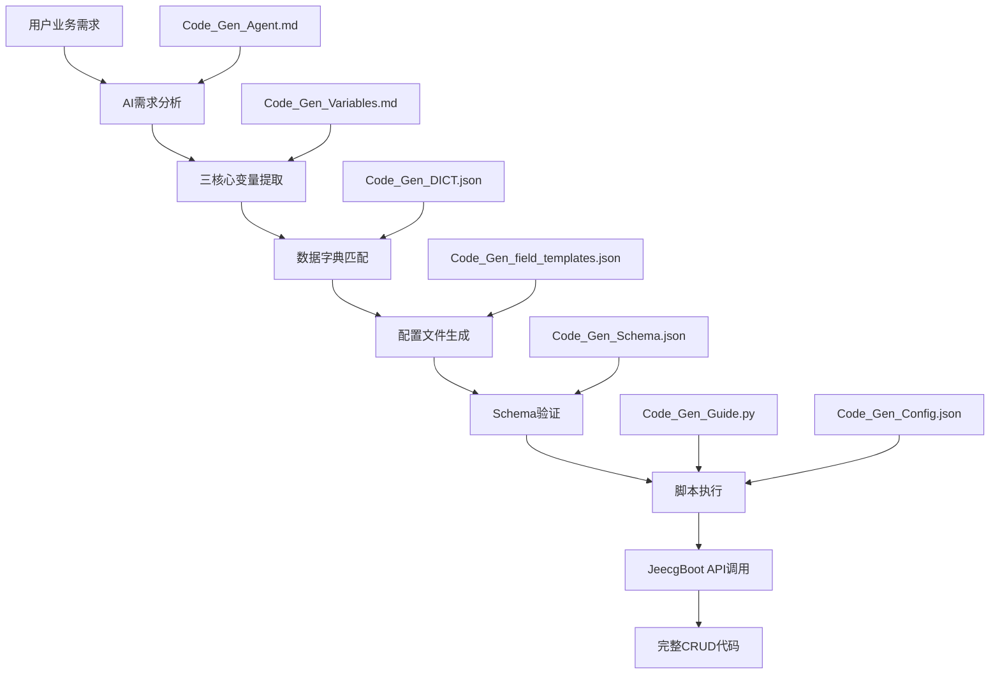

# JeecgBoot CodeGen 代码生成系统

## 📋 项目概述

JeecgBoot CodeGen 是一个基于 AI 驱动的智能代码生成系统，通过"需求分析+配置生成+API 调用"模式，将自然语言业务需求转化为完整的 JeecgBoot CRUD 功能模块。该系统结合了 AI 语义理解、配置标准化和自动化代码生成，显著提升开发效率。

### 🎯 核心特性

- **AI 智能分析**: 基于自然语言处理的业务需求理解和变量提取
- **配置标准化**: 通过 JSON Schema 严格验证配置文件格式和内容
- **自动化流程**: 一键生成完整的前后端代码、数据库结构和模块集成
- **模块化设计**: 清晰的文件职责分离和流程标准化
- **质量保证**: 多层次验证机制确保生成代码的正确性和可用性

## 📁 文件结构与功能定位

```
CodeGen/
├── README.md                      # 📖 本文档 - 系统概述和使用指南
├── Code_Gen_Guide.md               # 🔧 技术实现指南 - 脚本使用方法和配置文件结构
├── Code_Gen_Agent.md               # 🤖 AI代理规范 - AI行为边界和推理策略
├── Code_Gen_Variables.md           # 📊 变量定义规范 - 三核心变量详解
├── Code_Gen_Guide.py               # ⚡ 核心执行引擎 - 代码生成主脚本
├── Code_Gen_Config.json            # ⚙️ 系统配置 - 服务器连接和路径配置
├── Code_Gen_Guide.json             # 📋 模板配置 - 标准JSON模板
├── Code_Gen_Schema.json            # 🔍 验证模式 - JSON Schema验证规则
├── Code_Gen_Validator.py           # ✅ 配置验证器 - JSON格式和内容验证
├── Code_Gen_Example.json           # 📝 示例配置 - 完整的参考示例
├── Code_Gen_DICT.json              # 📚 数据字典 - 系统数据字典缓存
├── Code_Gen_field_templates.json   # 🎨 字段模板 - 13种字段类型模板
├── Code_Gen_JSON_Standards.md      # 🚨 JSON配置标准 - 技术规范和约束
└── temp_*_config.json              # 🚀 临时配置 - 运行时生成的配置文件
```

## 🔄 核心工作流程

### 流程架构图



### 执行步骤

1. **数据字典获取** (前置步骤)

   ```bash
   python3 Code_Gen_Guide.py --dict
   ```

2. **AI 需求分析** - 基于`Code_Gen_Agent.md`的推理策略

   - 语义理解和关键词提取
   - 三核心变量智能推理
   - 业务系统映射

3. **配置文件生成** - 使用`Code_Gen_field_templates.json`模板

   - 基于`Code_Gen_Guide.json`生成配置
   - 数据字典智能匹配
   - 字段类型自动推断

4. **配置验证** - 通过`Code_Gen_Schema.json`和`Code_Gen_Validator.py`

   - JSON 格式验证
   - 必需字段检查
   - API 兼容性验证

5. **代码生成执行** - `Code_Gen_Guide.py`调用 JeecgBoot API
   ```bash
   python3 Code_Gen_Guide.py --module-name [MODULE] --form-config temp_config.json
   ```

## 📊 三核心变量系统

### 变量定义 (详见 `Code_Gen_Variables.md`)

| 变量层级 | 变量名称        | 定义               | 示例            |
| -------- | --------------- | ------------------ | --------------- |
| 第一层   | MODULE_NAME     | 模块名/系统名称    | finance         |
| 第二层   | SUBMODULE_NAME  | 子模块名/系统模块  | invoice         |
| 第三层   | BUSINESS_ENTITY | 业务实体语义标识符 | CustomerProfile |

### 派生变量

- **TABLE_NAME**: `us_{MODULE_NAME}_{SUBMODULE_NAME}_{BUSINESS_ENTITY.toLowerCase()}`
- **PACKAGE_NAME**: `org.jeecg.modules.{MODULE_NAME}.{SUBMODULE_NAME}`
- **JAVA_ENTITY_NAME**: 直接使用 `{BUSINESS_ENTITY}` (已为 PascalCase 格式)

## 🤖 AI 代理系统

### AI 职责边界 (详见 `Code_Gen_Agent.md`)

**✅ AI 负责的工作**:

- 自然语言需求理解和语义分析
- 三核心变量智能提取和推理
- 数据字典智能匹配和字段类型推断
- JSON 配置文件生成和验证

**❌ AI 严格禁止的行为**:

- 手动编写 SQL、Java、Vue 等代码文件
- 使用 codebase-retrieval 等工具读取现有代码
- 修改 JeecgBoot 框架的任何现有文件
- 跳过标准工作流程或配置验证步骤

### 智能推理策略

- **语义分析优先**: 基于业务本质而非关键词匹配
- **多维度评估**: 从业务流程、管理对象、核心功能等维度分析
- **智能映射**: 优先映射到核心业务系统，支持新兴领域扩展
- **置信度评估**: 提供推理置信度评分和多候选方案

## 📝 配置文件详解

### 系统配置 (`Code_Gen_Config.json`)

**🚨 关键说明：项目路径配置规范**

系统根目录 `/Users/admin/Work/Github/JeecgBoot` **仅在** `Code_Gen_Config.json` 文件中定义，所有其他文件均通过读取该配置文件的 `project.path_prefix` 变量进行引用，确保路径配置的统一性和可维护性。

```json
{
  "project": {
    "path_prefix": "/Users/admin/Work/Github/JeecgBoot"  // 🎯 系统根目录的唯一定义位置
  },
  "server": {
    "base_url": "http://localhost:8080/jeecg-boot",
    "username": "admin",
    "password": "123456"
  },
  "timeouts": { ... },
  "compilation": { ... },
  "frontend_migration": { ... }
}
```

**路径配置架构**：

- **唯一配置源**：`Code_Gen_Config.json` 的 `project.path_prefix` 字段
- **变量引用方式**：其他文件通过 `CONFIG.get('project', {}).get('path_prefix')` 获取
- **派生路径计算**：`PROJECT_PATH = {path_prefix}/jeecg-boot/jeecg-boot-module/jeecg-module-{MODULE_NAME}`
- **配置变更影响**：修改该字段会自动影响整个系统的路径计算

### 模板配置 (`Code_Gen_Guide.json`)

包含完整的表单配置模板，包括 head 部分和 fields 数组的标准结构。

### 字段模板 (`Code_Gen_field_templates.json`)

提供 13 种字段类型的标准模板:

- `text_field` - 文本字段
- `number_field` - 数值字段
- `decimal_field` - 小数字段
- `date_field` / `datetime_field` - 日期时间字段
- `textarea_field` - 长文本字段
- `dict_select_field` / `dict_radio_field` - 数据字典选择字段
- `file_upload_field` / `image_upload_field` - 文件上传字段
- `rich_text_field` - 富文本字段
- `phone_field` / `email_field` - 联系方式字段

## 🔍 验证系统

### JSON Schema 验证 (`Code_Gen_Schema.json`)

定义了严格的配置文件结构规范:

- head 部分必需字段验证
- fields 数组结构和属性验证
- 数据类型和格式约束
- 表名命名规范验证

### 配置验证器 (`Code_Gen_Validator.py`)

提供程序化的配置文件验证:

- JSON 格式正确性检查
- 系统字段完整性验证
- 业务字段配置合规性检查
- API 兼容性验证

## 📚 数据字典系统

### 数据字典文件 (`Code_Gen_DICT.json`)

缓存 JeecgBoot 系统的数据字典信息，支持字段的智能匹配:

- 字典编码和名称
- 字典项值和文本
- 自动更新机制

### 智能匹配算法

- **精确匹配** (置信度 100%): 字段描述与字典名称完全匹配
- **语义匹配** (置信度 70-90%): 基于语义相似度匹配
- **模糊匹配** (置信度 50-70%): 部分关键词匹配
- **无匹配** (置信度 0%): 使用普通字段类型

## 🚀 快速开始

### 环境要求

- Python 3.7+
- JeecgBoot 后端服务 (localhost:8080)
- Maven 3.6+

### 基本使用

```bash
# 1. 获取最新数据字典
python3 Code_Gen_Guide.py --dict

# 2. 执行代码生成 (通过AI分析或手动配置)
python3 Code_Gen_Guide.py --module-name finance --form-config temp_config.json

# 3. 验证表名格式
python3 Code_Gen_Guide.py --validate-table-name us_finance_invoice_management
```

### AI 驱动的代码生成流程

1. **需求描述**: 使用自然语言描述业务需求
2. **AI 分析**: 系统自动分析并提取三核心变量
3. **配置生成**: 自动生成符合规范的 JSON 配置文件
4. **代码生成**: 一键生成完整的 CRUD 功能模块

## 🤖 AIGC 专用指导

### 🚨 关键约束 - 必须遵守

1. **系统字段 orderNum 连续性** (致命约束)

   - 必须从 0 开始严格连续递增：0,1,2,3,4,5,6,7,8...
   - 任何断裂都会导致 JeecgBoot API 调用失败
   - AI 常见错误：使用 990+高位数值，违反连续性要求

2. **系统字段配置标准化** (不可变更)

   - 前 7 个字段必须与`Code_Gen_Example.json`完全一致
   - 严禁修改系统字段的任何属性值
   - 直接复制标准模板，不做任何"优化"

3. **表名格式 4 段式** (严格规范)
   - 必须符合`us_模块_子模块_实体`格式
   - 实体部分必须是全小写连续格式
   - 不能有额外的下划线连接

### 📋 AIGC 生成流程

1. **生成前**：按照`Code_Gen_JSON_Standards.md`中的"AIGC 5 步快速检查流程"执行
2. **生成时**：直接复制`Code_Gen_Example.json`的系统字段配置
3. **生成后**：立即使用`Code_Gen_Validator.py`验证

### 🔍 必备验证工具

```bash
# AIGC生成后必须执行的验证
python3 Code_Gen_Validator.py temp_config.json
```

## ⚠️ 最佳实践

### 命名规范

- 严格遵循`us_{模块}_{子模块}_{业务场景}`表名格式
- 使用单一英文词汇，避免下划线和复合词
- 确保变量名语义明确，体现业务含义

### 配置文件管理

- 使用`temp_*_config.json`作为临时配置文件
- 通过 Schema 验证确保配置文件格式正确
- 保持系统字段完整性和业务字段合规性
- **AIGC 必须**：生成后立即进行连续性验证

### 质量保证

- 必须先获取数据字典再进行代码生成
- 通过多层验证机制确保配置文件质量
- **重要**：使用验证器检查 orderNum 连续性
- 使用官方 API 确保生成代码的标准化

## 🔧 故障排除

### 常见问题

1. **登录失败**: 检查 JeecgBoot 服务状态和配置文件中的用户名密码
2. **表名格式错误**: 使用`--validate-table-name`验证表名格式
3. **模块不存在**: 脚本会自动创建 Maven 模块
4. **数据字典匹配失败**: 重新获取数据字典缓存

### 调试技巧

- 使用`--dry-run`模式预览操作
- 检查临时配置文件的 JSON 格式
- 验证系统字段和业务字段的完整性
- 查看 API 响应的错误信息

## 📈 扩展开发

### 添加新的字段类型

1. 在`Code_Gen_field_templates.json`中定义新模板
2. 更新`Code_Gen_Schema.json`验证规则
3. 在 AI 推理策略中添加相应的匹配逻辑

### 自定义验证规则

1. 扩展`Code_Gen_Validator.py`验证器
2. 添加特定业务场景的验证逻辑
3. 更新 Schema 文件以支持新的验证规则

## 📞 技术支持

- **系统文档**: 参考各个`.md`文件的详细技术说明
- **配置示例**: 查看`Code_Gen_Example.json`了解完整配置
- **错误排查**: 使用验证工具诊断配置文件问题
- **社区支持**: JeecgBoot 官方技术社区

---

**版本**: 3.8.1  
**更新日期**: 2025-07-20  
**维护团队**: JeecgBoot 开发团队
