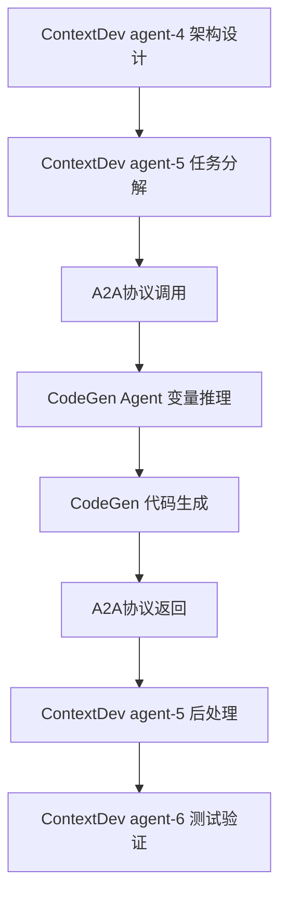

# Agent-to-Agent (A2A) 协议规范

## 📋 协议概述

**协议名称**: ContextDev-CodeGen A2A Integration Protocol  
**版本**: v1.0  
**设计目标**: 实现 ContextDev AI 编程方法论系统与 CodeGen 代码生成系统的无缝集成  
**适用范围**: JeecgBoot 3.8.1+ 框架项目开发

## 🔗 集成架构

### 系统角色定义

**ContextDev 系统**:

- **角色**: AI 编程方法论主导者
- **职责**: 需求分析、架构设计、任务分解、质量保证
- **核心 Agent**: agent-5 (实施推理师)

**CodeGen 系统**:

- **角色**: 代码生成执行者
- **职责**: CRUD 代码自动生成、JeecgBoot API 调用
- **核心 Agent**: CodeGen-Expert

### 集成流程图



## 📡 通信协议

### 3.1 协议格式

**协议标识**: `A2A-ContextDev-CodeGen-v1.0`

**消息结构**:

```yaml
a2a_protocol:
  version: "1.0"
  source_agent: "ContextDev-agent-5"
  target_agent: "codegen-expert"
  message_type: "code_generation_request" | "code_generation_response"
  timestamp: "YYYY-MM-DD HH:MM:SS"
  correlation_id: "UUID"
  payload: {}
```

### 3.2 请求消息格式

```yaml
# ContextDev agent-5 → CodeGen Agent
code_generation_request:
  # 系统上下文
  system_context:
    system_name: "{{SYSTEM_NAME}}"
    module_name: "{{MODULE_NAME}}"
    business_domain: "{{BUSINESS_DOMAIN}}"

  # 架构信息 (来自agent-4)
  architecture_info:
    entities: [{{ENTITY_LIST}}]
    relationships: [{{RELATIONSHIP_LIST}}]
    business_rules: [{{BUSINESS_RULES}}]

  # 代码生成需求
  generation_requirements:
    - entity_name: "{{ENTITY_NAME}}"
      table_name: "{{TABLE_NAME}}"
      generation_type: "crud" | "tree" | "one_to_many"
      business_fields: [{{FIELD_DEFINITIONS}}]
      customization_level: "basic" | "advanced" | "custom"

  # 质量要求
  quality_requirements:
    code_coverage: "{{COVERAGE_PERCENTAGE}}"
    performance_requirements: [{{PERFORMANCE_SPECS}}]
    integration_points: [{{INTEGRATION_SPECS}}]
```

### 3.3 响应消息格式

```yaml
# CodeGen Agent → ContextDev agent-5
code_generation_response:
  # 执行状态
  execution_status:
    overall_result: "Pass" | "Fail"
    execution_time: "{{DURATION}}"
    generated_modules: [{{MODULE_LIST}}]

  # 生成结果
  generation_results:
    - entity: "{{ENTITY_NAME}}"
      status: "success" | "failed" | "partial"
      generated_files:
        backend_files: [{{BACKEND_FILE_LIST}}]
        frontend_files: [{{FRONTEND_FILE_LIST}}]
        database_files: [{{SQL_FILE_LIST}}]
      customization_notes: [{{CUSTOMIZATION_REQUIREMENTS}}]

  # 后续任务
  post_generation_tasks:
    manual_customizations: [{{MANUAL_TASK_LIST}}]
    integration_tasks: [{{INTEGRATION_TASK_LIST}}]
    testing_recommendations: [{{TESTING_TASK_LIST}}]

  # 错误信息 (如果有)
  error_details:
    error_code: "{{ERROR_CODE}}"
    error_message: "{{ERROR_MESSAGE}}"
    resolution_suggestions: [{{RESOLUTION_LIST}}]
```

## 🔄 协作流程

### 4.1 标准集成流程

**Phase 1: 准备阶段**

1. ContextDev agent-4 完成架构设计
2. ContextDev agent-5 解析架构文档
3. agent-5 识别 CodeGen 适用的组件

**Phase 2: A2A 调用阶段**

1. agent-5 构建 A2A 请求消息
2. 通过 A2A 协议调用 CodeGen Agent
3. CodeGen Agent 执行三核心变量推理
4. CodeGen Agent 执行代码生成流程

**Phase 3: 结果处理阶段**

1. CodeGen Agent 返回生成结果
2. agent-5 解析响应消息
3. agent-5 规划后续定制化任务
4. 传递给 agent-6 进行测试验证

### 4.2 异常处理流程

**CodeGen 执行失败**:

1. CodeGen Agent 返回失败状态
2. agent-5 分析失败原因
3. 降级为手动开发任务
4. 更新开发计划和时间估算

**部分生成成功**:

1. 处理成功生成的组件
2. 识别失败的组件原因
3. 制定混合开发策略
4. 更新任务优先级

## 📊 数据映射规范

### 5.1 ContextDev → CodeGen 映射

| ContextDev 概念 | CodeGen 概念    | 映射规则           |
| --------------- | --------------- | ------------------ |
| 系统名称        | MODULE_NAME     | 直接映射或语义转换 |
| 模块名称        | SUBMODULE_NAME  | 直接映射           |
| 业务实体        | BUSINESS_ENTITY | PascalCase 转换    |
| 数据表设计      | 字段配置        | 字段类型和约束映射 |
| 业务规则        | 定制化需求      | 规则复杂度评估     |

### 5.2 质量标准映射

| ContextDev 质量要求 | CodeGen 实现方式  |
| ------------------- | ----------------- |
| 代码覆盖率 ≥70%     | 自动生成基础 CRUD |
| 性能要求            | 数据库索引优化    |
| 集成要求            | API 接口标准化    |
| 可维护性            | 代码结构规范化    |

## 🛠️ 实施接口

### 6.1 ContextDev agent-5 增强

**新增方法**:

```python
def invoke_codegen_agent(self, generation_request):
    """调用CodeGen Agent进行代码生成"""

def parse_codegen_response(self, response):
    """解析CodeGen响应并更新开发计划"""

def plan_post_generation_tasks(self, generation_results):
    """规划代码生成后的定制化任务"""
```

### 6.2 CodeGen Agent 增强

**新增方法**:

```python
def handle_a2a_request(self, request):
    """处理来自ContextDev的A2A请求"""

def extract_variables_from_architecture(self, arch_info):
    """从架构信息中提取三核心变量"""

def generate_a2a_response(self, results):
    """生成标准化的A2A响应"""
```

## 📈 集成效益评估

### 7.1 开发效率提升

- **代码生成覆盖率**: 70-80%的基础功能自动生成
- **开发时间节省**: 基础 CRUD 功能开发时间减少 80%
- **代码质量保证**: 标准化的代码结构和规范

### 7.2 质量保证增强

- **一致性保证**: 统一的代码风格和架构模式
- **错误减少**: 自动生成减少人工编码错误
- **测试覆盖**: 自动生成的代码包含基础测试用例

### 7.3 协作效率优化

- **无缝集成**: Agent 间自动化协作，减少人工干预
- **智能决策**: 基于架构复杂度自动选择生成策略
- **质量追溯**: 完整的生成过程记录和质量追踪

## 🚀 实施建议

### 8.1 集成实施步骤

**阶段 1: 协议实现 (1-2 周)**

1. 在 ContextDev agent-5 中实现 A2A 协议客户端
2. 在 CodeGen Agent 中实现 A2A 协议服务端
3. 实现数据映射和转换逻辑
4. 开发异常处理机制

**阶段 2: 功能集成 (2-3 周)**

1. 集成三核心变量自动推理功能
2. 实现架构信息到 CodeGen 配置的自动转换
3. 开发代码生成结果的智能解析
4. 实现后续任务的自动规划

**阶段 3: 测试验证 (1-2 周)**

1. 单元测试：各组件功能验证
2. 集成测试：A2A 协议端到端测试
3. 性能测试：大规模项目集成测试
4. 用户验收测试：实际项目验证

**阶段 4: 优化部署 (1 周)**

1. 性能优化和错误处理完善
2. 文档完善和用户指南编写
3. 生产环境部署和监控
4. 用户培训和技术支持

### 8.2 技术风险评估

**高风险项**:

- **数据映射复杂性**: 架构信息到 CodeGen 变量的准确映射
- **异常处理完整性**: CodeGen 失败时的降级策略
- **性能影响**: A2A 调用对整体开发流程的性能影响

**中风险项**:

- **版本兼容性**: 两套系统的版本同步和兼容性维护
- **配置复杂性**: A2A 协议的配置和维护复杂度

**低风险项**:

- **接口稳定性**: 基于成熟的 YAML/JSON 格式
- **框架兼容性**: 都基于 JeecgBoot 框架，兼容性良好

### 8.3 成功关键因素

**技术因素**:

1. **准确的数据映射**: 确保架构信息到 CodeGen 配置的准确转换
2. **健壮的异常处理**: 完善的错误处理和降级机制
3. **性能优化**: 保证 A2A 调用不影响整体开发效率

**流程因素**:

1. **标准化协议**: 严格遵循 A2A 协议规范
2. **质量保证**: 完整的测试验证流程
3. **文档完善**: 详细的集成文档和使用指南

**组织因素**:

1. **团队协作**: ContextDev 和 CodeGen 团队的紧密协作
2. **用户培训**: 开发人员对集成系统的培训
3. **持续改进**: 基于使用反馈的持续优化

## 📚 附录

### A. 示例场景

**场景**: 电商系统产品管理模块开发

**输入** (ContextDev agent-4 架构输出):

```yaml
entities:
  - name: "Product"
    fields: ["name", "price", "category", "description"]
  - name: "Category"
    fields: ["name", "parent_id", "sort_order"]
```

**A2A 请求**:

```yaml
generation_requirements:
  - entity_name: "Product"
    table_name: "us_ecommerce_product_info"
    generation_type: "crud"
    business_fields:
      [
        { name: "name", type: "string", required: true },
        { name: "price", type: "decimal", required: true },
        { name: "category_id", type: "integer", required: true },
      ]
```

**CodeGen 响应**:

```yaml
generation_results:
  - entity: "Product"
    status: "success"
    generated_files:
      backend_files:
        ["ProductController.java", "ProductService.java", "Product.java"]
      frontend_files: ["ProductList.vue", "ProductForm.vue"]
      database_files: ["product_ddl.sql"]
```

### B. 错误代码定义

| 错误代码 | 错误描述             | 解决建议                |
| -------- | -------------------- | ----------------------- |
| A2A-001  | 三核心变量推理失败   | 检查架构信息完整性      |
| A2A-002  | CodeGen 配置生成失败 | 验证字段定义格式        |
| A2A-003  | 代码生成执行失败     | 检查 JeecgBoot 服务状态 |
| A2A-004  | 响应解析失败         | 验证响应消息格式        |
