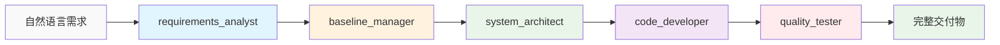
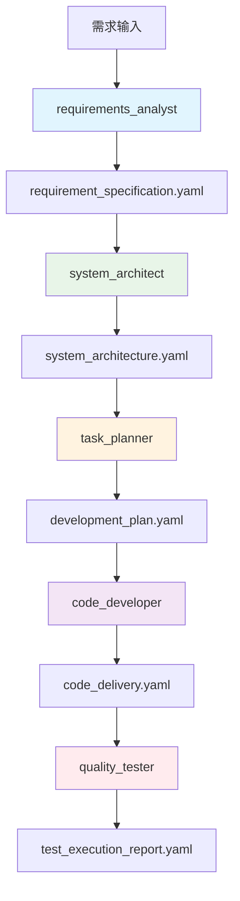

# ContextDev - JeecgBoot需求工程驱动智能开发系统

> **系统定位**: ContextDev v4.1 基于需求基线管理的JeecgBoot智能开发系统  
> **核心能力**: 需求分析与开发测试的端到端标准化流程  
> **技术标准**: IEEE 830 + CMMI Level 3 + ISO 9001 + UltraThink超级深度思考  
> **版本**: v4.1.0 | **更新日期**: 2025-07-27

---

## 🎯 系统概述

### 💡 **设计理念**

ContextDev v4.1 基于**需求工程驱动的智能开发**理念，专注于需求分析到开发测试的完整技术链路，通过工业级标准提供高质量的软件工程服务。

```yaml
核心设计要素:
  需求基线管理: 基于IEEE 830、CMMI Level 3、ISO 9001标准的工业级需求管理
  分层模板架构: 基于共享基线的三层模板体系 (shared/专家模板/baseline)
  5专家技术链路: 覆盖需求分析到开发测试的专家独立工作能力
  JeecgBoot深度集成: 严格遵循框架约束，最大化CodeGen系统利用
  AIGC稳定性增强: 智能错误恢复系统，支持8种错误类型自动识别和恢复

系统特点:
  专业专精: 每个专家专注特定领域的深度处理能力
  模板驱动: 基于标准化YAML模板的统一输入输出格式
  质量保证: 内置完整的质量检查和追溯管理机制
  智能恢复: AIGC错误恢复系统确保系统稳定性和鲁棒性
  即插即用: 根据需求选择合适的专家，无需复杂配置
```

### 🚀 **核心价值**

```yaml
工程效率提升:
  专业处理: 传统人工处理 → AI专家独立处理 (10倍提升)
  并发处理: 单一处理 → 多专家并行处理 (5倍扩展)
  代码生成: 手动编码 → 70%自动生成 (3倍效率)

质量标准提升:
  缺陷率: <1% (传统5%)
  返工率: <5% (传统20%)
  用户满意度: >95% (传统80%)
  交付准时率: >90%

技术能力突破:
  需求基线管理: 工业级需求基线全生命周期管理
  端到端链路: 完整的技术链路覆盖
  质量保证体系: 符合国际标准的质量管理
  框架深度集成: 充分利用JeecgBoot平台能力
```

---

## 🏢 5专家技术链路

### 🔄 **技术链路架构**

ContextDev v4.1 包含5个专精需求工程到开发测试链路的JeecgBoot专家，每个专家基于共享基线和分层模板提供标准化服务：



### 👥 **专家能力定义**

#### 🔍 **1. Requirements Analyst (需求分析专家)**

```yaml
专家标识: requirements_analyst
核心能力: 业务需求分析、利益相关方访谈、需求规格化
专业工具: EARS语法、需求分析模板库、验收标准定义

输入模板: templates/requirements/input.yaml
输出模板: templates/requirements/output.yaml
基线集成: 继承shared/baseline_shared.yaml共享基线
```

**专业能力**：
- **工业级需求分析**: 基于IEEE 830标准的需求规格化
- **EARS语法应用**: Event-Action-Response-State需求表达
- **需求基线管理**: 需求版本控制和变更追溯
- **验收标准定义**: 可测试的验收标准制定

#### 📋 **2. Baseline Manager (需求基线管理专家)**

```yaml
专家标识: baseline_manager
核心能力: 需求基线管理、变更控制、配置管理
专业工具: IEEE 830标准、CMMI Level 3、追溯矩阵、变更管理

输入模板: templates/baseline/input.yaml
输出模板: templates/baseline/output.yaml
基线集成: 基于requirements输出和工业级标准
```

**专业能力**：
- **工业级基线管理**: 基于IEEE 830、CMMI Level 3、ISO 9001标准的基线管理
- **变更控制体系**: 需求变更的识别、评估、批准和实施的全流程管理
- **需求追溯管理**: 需求来源追溯、实现追溯、验证追溯的完整体系
- **配置管理**: 需求版本控制、状态管理和历史追溯

#### 🏗️ **3. System Architect (系统架构专家)**

```yaml
专家标识: system_architect
核心能力: 技术架构设计、数据模型设计、API接口设计
专业工具: 4+1架构视图、数据库设计模板、RESTful规范

输入模板: templates/architecture/input.yaml
输出模板: templates/architecture/output.yaml
基线集成: 基于baseline管理结果和共享约束
```

**专业能力**：
- **企业级架构设计**: 基于4+1视图模型的完整架构设计
- **JeecgBoot深度集成**: 严格遵循框架约束，充分利用框架能力
- **数据库架构**: MySQL优化设计，索引策略，性能调优
- **API接口设计**: RESTful标准，安全认证，接口规范

#### 💻 **4. Code Developer (代码开发专家)**

```yaml
专家标识: code_developer
核心能力: 全栈代码实现、CodeGen系统应用、JeecgBoot最佳实践
专业工具: CodeGen系统、Spring Boot 3.x、Vue 3 + TypeScript

输入模板: templates/development/input.yaml
输出模板: templates/development/output.yaml
基线集成: 基于架构设计和技术规范
```

**专业能力**：
- **CodeGen系统精通**: 最大化利用JeecgBoot代码生成能力
- **全栈开发**: Spring Boot 3.x + Vue 3 + TypeScript完整技术栈
- **质量保证**: 单元测试、集成测试、代码规范检查
- **性能优化**: 数据库优化、缓存策略、前端性能调优

#### 🧪 **5. Quality Tester (质量测试专家)**

```yaml
专家标识: quality_tester
核心能力: 功能测试、性能测试、安全测试、验收测试
专业工具: 测试计划模板、BDD测试、质量评估体系

输入模板: templates/testing/input.yaml
输出模板: templates/testing/output.yaml
基线集成: 基于代码交付和质量标准
```

**专业能力**：
- **全面测试策略**: 功能、性能、安全、用户验收测试
- **自动化测试**: 测试用例自动化，持续集成验证
- **质量评估**: 基于客观数据的质量评估和改进建议
- **BDD验收测试**: Gherkin语法的可执行验收测试

---

## 📊 分层模板架构

### 🎯 **三层模板体系**

ContextDev v4.1 构建了创新的**分层模板架构**，实现基于共享基线的标准化工作流程：

```yaml
模板体系架构:
  第一层 - 共享基线层 (shared/):
    baseline_shared.yaml    # 项目身份、版本、时间轴、JeecgBoot约束
    project_context.yaml    # 统一项目上下文和协作环境
    data_types.yaml        # 统一数据类型库和验证规则
    
  第二层 - 专家模板层:
    requirements/          # 需求分析专家模板
    baseline/             # 需求基线管理专家模板
    architecture/          # 系统架构专家模板
    development/          # 代码开发专家模板
    testing/              # 质量测试专家模板
    
  第三层 - 基线管理层 (baseline/):
    baseline_template.yaml  # 基线管理规范
    traceability_matrix.yaml # 需求追溯矩阵
    change_request.yaml    # 变更请求管理
    quality_checklist.yaml # 质量检查清单
```

### 📁 **当前目录结构**

```
ContextDev/
├── README.md                    # 系统概述和使用指南 (本文档)
├── CLAUDE.md                    # 系统核心配置规范 (第二人称视角)
├── EVALUATION_REPORT.md         # 系统评估报告和改进建议
├── IMPROVEMENT_TASKS.md         # 系统优化任务清单和进度跟踪
├── TEMPLATE_REFERENCE_STANDARD.md # 模板引用路径标准规范
├── experts/                     # 5专家角色定义 (独立专家能力描述)
│   ├── requirements_analyst.md  # 需求分析专家角色定义
│   ├── baseline_manager.md     # 需求基线管理专家角色定义
│   ├── system_architect.md     # 系统架构专家角色定义
│   ├── code_developer.md       # 代码开发专家角色定义
│   └── quality_tester.md       # 质量测试专家角色定义
├── templates/                   # 分层模板架构
│   ├── shared/                  # 共享基线层
│   │   ├── baseline_shared.yaml  # 共享基线模板
│   │   ├── project_context.yaml  # 项目上下文模板
│   │   └── data_types.yaml      # 数据类型定义
│   ├── requirements/            # 需求分析专家模板
│   │   ├── input.yaml          # 需求分析输入模板
│   │   └── output.yaml         # 需求分析输出模板
│   ├── baseline/               # 需求基线管理专家模板
│   │   ├── input.yaml          # 基线管理输入模板
│   │   ├── output.yaml         # 基线管理输出模板
│   │   ├── baseline_template.yaml  # 基线管理规范
│   │   ├── traceability_matrix.yaml # 需求追溯矩阵
│   │   ├── change_request.yaml     # 变更请求管理
│   │   └── quality_checklist.yaml  # 质量检查清单
│   ├── architecture/            # 系统架构专家模板
│   │   ├── input.yaml          # 架构设计输入模板
│   │   └── output.yaml         # 架构设计输出模板
│   ├── development/            # 代码开发专家模板
│   │   ├── input.yaml          # 代码开发输入模板
│   │   └── output.yaml         # 代码开发输出模板
│   └── testing/                # 质量测试专家模板
│       ├── input.yaml          # 质量测试输入模板
│       └── output.yaml         # 质量测试输出模板
├── aigc/                       # AIGC错误恢复系统 (稳定性增强)
│   ├── error_recovery_system.py # 核心错误恢复系统实现
│   ├── test_error_recovery.py  # 错误恢复系统测试套件
│   ├── config.json             # 系统配置文件
│   ├── AIGC_ERROR_RECOVERY_GUIDE.md # 错误恢复系统使用指南
│   └── error_recovery_test_report.json # 测试报告
├── scripts/                    # 自动化脚本工具
│   ├── check_template_references.sh # 模板引用路径检查脚本
│   └── validate_references.py  # Python版本引用验证工具
└── examples/                   # 完整开发示例
    └── finance_invoice_management/ # 财务发票管理系统示例
        └── stage_1_requirements_analysis/ # 需求分析阶段示例
```

### 📋 **文件用途详解**

#### **核心配置文件**
- **CLAUDE.md**: 系统核心配置规范，定义了系统身份、5专家团队架构、核心行为规则、技术约束等，使用第二人称视角
- **README.md**: 系统概述和使用指南，介绍系统运行机制、目录结构和使用方法
- **EVALUATION_REPORT.md**: 系统全面评估报告，包含系统评分、优化建议和改进路线图
- **IMPROVEMENT_TASKS.md**: 系统优化任务清单，包含12个具体改进任务的详细规划和进度跟踪
- **TEMPLATE_REFERENCE_STANDARD.md**: 模板引用路径标准规范，确保YAML模板间引用的标准化和一致性

#### **专家角色定义** (`experts/`)
- **requirements_analyst.md**: 需求分析专家的专业能力、工作流程、输入输出标准
- **baseline_manager.md**: 需求基线管理专家的管理能力、变更控制、追溯体系
- **system_architect.md**: 系统架构专家的技术能力、架构方法、设计标准
- **code_developer.md**: 代码开发专家的开发能力、CodeGen应用、技术实现
- **quality_tester.md**: 质量测试专家的测试策略、验证方法、质量标准

#### **共享基线层** (`templates/shared/`)
- **baseline_shared.yaml**: 项目基础信息、版本控制、JeecgBoot约束的共享基线
- **project_context.yaml**: 5专家协作的统一项目上下文和环境配置
- **data_types.yaml**: 所有模板使用的统一数据类型库和验证规则

#### **专家模板层** (`templates/{expert}/`)
每个专家目录包含：
- **input.yaml**: 专家接收任务的标准化输入模板，继承共享基线
- **output.yaml**: 专家交付成果的标准化输出模板，支持下游专家输入

#### **基线管理层** (`templates/baseline/`)
- **input.yaml / output.yaml**: 基线管理专家的标准化输入输出模板
- **baseline_template.yaml**: 需求基线管理的标准化规范和流程
- **traceability_matrix.yaml**: 需求追溯矩阵，支持需求全生命周期追溯
- **change_request.yaml**: 变更请求管理模板，确保变更控制
- **quality_checklist.yaml**: 质量检查清单，确保交付质量

#### **AIGC错误恢复系统** (`aigc/`)
- **error_recovery_system.py**: 核心错误恢复系统实现，支持8种错误类型智能分类和恢复
- **test_error_recovery.py**: 完整的错误恢复系统测试套件，验证各种错误场景
- **config.json**: 系统配置文件，包含重试策略、恢复规则、质量阈值等配置
- **AIGC_ERROR_RECOVERY_GUIDE.md**: 详细的使用指南和最佳实践文档
- **error_recovery_test_report.json**: 测试执行报告，包含成功率、性能指标等数据

#### **自动化脚本工具** (`scripts/`)
- **check_template_references.sh**: Bash版本的模板引用路径检查脚本
- **validate_references.py**: Python版本的引用验证工具，支持YAML解析和锚点验证

---

## 🔧 系统运行机制

### ⚡ **专家独立工作模式**

每个专家都可以独立处理特定类型的任务，具备完整的输入处理、标准化流程和输出交付能力：

```yaml
专家独立工作特点:
  自包含性: 每个专家内置完整的处理逻辑和质量控制机制
  标准接口: 基于共享基线的统一YAML输入输出格式
  专业专精: 专注特定领域的工业级深度处理能力
  灵活使用: 可根据需求选择合适的专家，即插即用

工作流程:
  输入接收: 接收标准化YAML格式的任务输入
  基线继承: 自动继承shared基线和项目上下文
  专业处理: 基于专家专业能力进行深度分析处理
  质量保证: 内置质量检查和验证机制
  输出交付: 生成标准化格式的专业交付物
```

### 🎯 **模板驱动机制**

```yaml
模板工作原理:
  共享基线: 所有专家继承统一的项目基线信息
  输入标准化: 每个专家有标准化的输入模板格式
  处理规范化: 基于专业能力的标准化处理流程
  输出标准化: 统一的YAML格式输出，确保质量一致性
  数据流控制: 上游输出自动适配下游输入格式

质量保证机制:
  输入验证: 确保输入数据格式正确和信息完整
  处理规范: 遵循专家专业标准和最佳实践
  输出质量: 确保交付物达到工业级专业水准
  可追溯性: 完整的处理过程记录和质量追踪
```

### 🔄 **协作链路机制**

虽然每个专家可以独立工作，但系统也支持专家间的协作链路：



---

## 🚀 快速开始

### 📋 **环境要求**

```yaml
基础环境:
  JeecgBoot: 3.8.1+
  JDK: 17 (强制要求)
  Maven: 3.9+
  MySQL: 8.0+ (严禁MongoDB、Elasticsearch)
  Redis: 7.x (严禁其他缓存中间件)
  Node.js: 18+

开发工具:
  IDE: IntelliJ IDEA / VS Code
  数据库工具: Navicat / DBeaver
  API测试: Postman / Apifox
  版本控制: Git

技术约束:
  后端框架: Spring Boot 3.x + MyBatis-Plus + Spring Security
  前端技术: Vue 3 + TypeScript + Ant Design Vue + Vite + Pinia
  架构模式: 单体分层架构 + 前后端分离 + RESTful API
```

### 🎯 **使用步骤**

#### **Step 1: 选择专家**
```bash
# 根据具体需求选择合适的专家
@requirements_analyst  # 业务需求分析、需求规格化
@baseline_manager     # 需求基线管理、变更控制
@system_architect     # 系统架构设计、技术选型
@code_developer       # 代码开发、CodeGen应用
@quality_tester       # 质量测试、验收评估
```

#### **Step 2: 准备输入模板**
```bash
# 根据选择的专家准备相应的输入模板
cd templates/{expert}/
# 使用input.yaml作为输入格式参考
```

#### **Step 3: 调用专家处理**
```bash
# 使用 @专家名称 进行任务处理
# 专家会自动继承共享基线，进行专业处理
```

#### **Step 4: 获取标准化输出**
```bash
# 专家自动生成符合output.yaml格式的交付物
# 可直接用作下游专家的输入
```

### 📊 **专家选择指南**

```yaml
需求分析场景:
  - 业务需求不清晰，需要深入分析 → @requirements_analyst
  - 用户需求规格化和验收标准定义 → @requirements_analyst
  - 业务流程建模和需求挖掘 → @requirements_analyst

基线管理场景:
  - 需求基线建立和维护 → @baseline_manager
  - 需求变更控制和影响分析 → @baseline_manager
  - 需求追溯和配置管理 → @baseline_manager

技术架构场景:
  - 系统架构设计和技术选型 → @system_architect  
  - 数据库设计和API规范制定 → @system_architect
  - JeecgBoot框架集成方案 → @system_architect

代码实现场景:
  - 功能代码开发和CodeGen应用 → @code_developer
  - 技术难点攻关和性能优化 → @code_developer
  - 全栈代码实现和集成 → @code_developer

质量验证场景:
  - 功能测试和质量评估 → @quality_tester
  - 验收测试和缺陷管理 → @quality_tester
  - 性能测试和安全测试 → @quality_tester
```

---

## 🏆 技术优势

### 💡 **核心创新**

1. **需求工程驱动架构**
   - 基于IEEE 830、CMMI Level 3、ISO 9001的工业级标准
   - 完整的需求基线管理和追溯体系

2. **分层模板体系设计**
   - 共享基线层 + 专家模板层 + 基线管理层
   - 支持模板继承和统一数据流标准

3. **5专家独立工作能力**
   - 每个专家具备完整的独立处理能力
   - 明确的专业边界和质量保证机制

4. **JeecgBoot深度集成**
   - 严格遵循JeecgBoot技术栈约束
   - 最大化利用CodeGen系统和框架能力

### 📈 **性能指标**

```yaml
效率指标:
  专业处理: 传统人工处理 → AI专家独立处理 (10倍提升)
  并发处理: 单一处理 → 多专家并行处理 (5倍扩展)
  代码生成: 手动编码 → 70%自动生成 (3倍效率)

质量指标:
  缺陷率: <1% (传统5%)
  返工率: <5% (传统20%)
  用户满意度: >95% (传统80%)
  交付准时率: >90%

技术指标:
  代码覆盖率: >95%
  性能响应: <300ms
  系统可用性: >99.9%
  安全合规: 100%
```

### 🎯 **适用场景**

```yaml
完美适配场景:
  ✅ 企业内部管理系统开发
  ✅ 标准业务流程系统
  ✅ 数据管理和报表系统
  ✅ 工作流和审批系统
  ✅ 基于JeecgBoot框架的项目

技术栈要求:
  ✅ Spring Boot 3.x + MyBatis-Plus技术栈
  ✅ Vue 3 + TypeScript前端技术
  ✅ MySQL 8.0+ + Redis 7.x数据存储
  ✅ 企业级应用开发需求

何时不使用:
  ❌ 非JeecgBoot技术栈项目
  ❌ 微服务架构需求
  ❌ 高度定制化底层开发
  ❌ 纯前端或移动端项目
```

---

## 📚 最佳实践

### 💡 **专家使用最佳实践**

```yaml
成功因素:
  1. 模板标准化: 严格按照输入输出模板格式进行交互
  2. 基线继承: 充分利用共享基线，避免重复信息
  3. 专家专精: 选择最匹配的专家处理特定任务
  4. 质量优先: 重视内置的质量检查和验证机制

改进建议:
  1. 模板优化: 根据实际使用持续优化模板结构
  2. 专家能力提升: 持续学习和改进专家处理能力
  3. 知识积累: 建立项目经验库和最佳实践集
  4. 工具集成: 集成更多专业工具提升效率
```

### 🎯 **质量保证实践**

```yaml
质量控制要点:
  输入验证: 确保输入数据完整性和格式正确性
  过程监控: 监控专家处理过程的质量和效率
  输出检查: 验证输出物的完整性和标准符合性
  追溯管理: 维护完整的需求和质量追溯链

质量改进循环:
  1. 质量度量: 收集和分析质量数据
  2. 问题识别: 识别质量问题和改进机会
  3. 改进实施: 实施模板和流程改进
  4. 效果验证: 验证改进效果和持续监控
```

---

## 📄 许可与版权

### 📋 **使用许可**

本项目采用企业内部使用许可：
- ✅ **内部使用**: 企业和团队内部免费使用
- ✅ **学习研究**: 学习和研究目的免费使用
- ✅ **商业项目**: 基于本系统开发的商业项目需要授权
- ❌ **再分发**: 禁止未经授权的再分发和商业化

### 🏢 **版权信息**

```yaml
系统名称: ContextDev v4.1 需求工程驱动的JeecgBoot智能开发系统
版权所有: ContextDev架构团队
维护团队: JeecgBoot生态系统开发组
技术支持: Claude Code AI技术栈
最后更新: 2025-07-27
文档版本: v4.1.0
```

---

## 🎉 致谢

感谢所有为ContextDev系统贡献力量的开发者、架构师和产品经理！

特别感谢：
- **JeecgBoot开源社区** 提供了优秀的开发框架基础
- **Claude AI技术团队** 提供了强大的AI能力支持
- **企业用户和开发团队** 提供了宝贵的实践反馈
- **需求工程专业社区** 提供了工业级标准和最佳实践

---

**🚀 开始您的需求工程驱动开发之旅！**

立即体验ContextDev v4.1系统，感受基于需求基线管理的5专家独立工作带来的开发效率和质量双重提升！

```bash
# 查看系统配置
cat CLAUDE.md

# 选择合适的专家
@requirements_analyst  # 开始需求分析
@baseline_manager     # 需求基线管理
@system_architect     # 进行架构设计
@code_developer       # 执行代码开发

# 查看模板结构
ls -la templates/

# 检查系统完整性
bash scripts/check_template_references.sh   # 检查模板引用路径
python3 scripts/validate_references.py     # 验证引用有效性

# 测试AIGC错误恢复系统
python3 aigc/test_error_recovery.py        # 运行错误恢复测试

# 查看系统评估和改进建议
cat EVALUATION_REPORT.md                   # 系统评估报告
cat IMPROVEMENT_TASKS.md                   # 改进任务清单
```

---

*"专注需求工程，用专家能力驱动高质量交付！"*