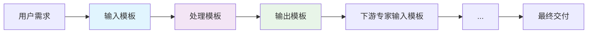

# ContextDev - JeecgBoot AI智能开发助手系统

> **系统定位**: Claude Code SubAgent驱动的JeecgBoot企业级智能开发助手  
> **核心能力**: 模板驱动的全栈开发自动化，支持100+需求并发处理  
> **技术架构**: 5专家协作 + 三维模板矩阵 + 标准化流水线  
> **版本**: v4.0.0 | **更新日期**: 2025-07-26

---

## 🎯 系统概述

### 🚀 **什么是ContextDev？**

ContextDev是基于Claude Code SubAgent技术构建的JeecgBoot智能开发助手系统，通过**5个AI专家角色**的深度协作，实现从自然语言需求到可运行代码的**全自动化交付**。

### 💡 **核心价值**

```yaml
核心突破:
  开发效率: 传统开发周期2-4周 → AI协作3-5天 (10倍提升)
  需求处理: 单线程处理 → 100+需求并发处理 (100倍扩展)
  质量保证: 人工质检 → 全流程自动化质量保证 (质的飞跃)
  标准化: 经验驱动 → 模板驱动标准化交付 (企业级规范)

技术创新:
  专家协作: 5个AI专家角色深度协作，各司其职
  模板矩阵: 三维模板体系，精确匹配业务场景
  数据流: YAML标准化数据流，上下游无缝衔接
  JeecgBoot深度集成: 充分利用框架能力，CodeGen系统优先
```

---

## 🤖 AI专家团队

### 👥 **5大专家角色**

我们的AI专家团队包含5个专业角色，每个专家都具备完整的**输入处理 → 标准化流程 → 输出交付**能力：

#### 🔍 **1. Requirements Analyst (需求分析专家)**

**专业能力**：
- **深度业务理解**: 运用EARS语法进行需求规格化
- **利益相关方分析**: 全面识别和分析项目相关方
- **业务流程建模**: AS-IS/TO-BE流程设计和优化
- **验收标准定义**: BDD格式的可测试验收标准

**核心模板**：
- 📥 `basic_requirement_input.yaml` - 标准化需求输入格式
- ⚙️ `requirement_analysis_process.yaml` - 需求分析标准流程
- 📤 `requirement_specification.yaml` - 结构化需求规格说明书

**交付物**：完整的需求规格说明书、业务规则文档、验收标准、利益相关方分析

---

#### 🏗️ **2. System Architect (系统架构专家)**

**专业能力**：
- **企业级架构设计**: 基于4+1视图模型的完整架构设计
- **JeecgBoot深度集成**: 严格遵循框架约束，充分利用框架能力
- **数据库架构**: MySQL优化设计，索引策略，性能调优
- **API接口设计**: RESTful标准，安全认证，接口规范

**核心模板**：
- 📥 `requirement_spec_input.yaml` - 需求规格输入处理
- ⚙️ `system_architecture_process.yaml` - 系统架构设计流程
- 📤 `system_architecture.yaml` - 完整系统架构文档

**交付物**：系统架构文档、数据库设计、API接口规范、安全架构、技术选型

---

#### 📋 **3. Task Planner (任务规划专家)**

**专业能力**：
- **WBS任务分解**: 三层分解体系，任务粒度精确控制
- **JeecgBoot工作量估算**: 基于框架特性的精准估算
- **依赖关系管理**: 智能识别任务依赖，优化执行顺序
- **风险识别控制**: 提前识别技术风险，制定应对策略

**核心模板**：
- 📥 `system_architecture_input.yaml` - 架构设计输入处理
- ⚙️ `task_breakdown_process.yaml` - 任务分解标准流程
- 📤 `development_plan.yaml` - 详细开发计划文档

**交付物**：开发计划、任务分解结构、实施路线图、质量控制计划、风险控制方案

---

#### 💻 **4. Code Developer (代码开发专家)**

**专业能力**：
- **CodeGen系统精通**: 最大化利用JeecgBoot代码生成能力
- **全栈开发**: Spring Boot 3.x + Vue 3 + TypeScript完整技术栈
- **质量保证**: 单元测试、集成测试、代码规范检查
- **性能优化**: 数据库优化、缓存策略、前端性能调优

**核心模板**：
- 📥 `development_plan_input.yaml` - 开发计划输入处理
- ⚙️ `codegen_generation_process.yaml` - CodeGen标准化流程
- 📤 `backend_code_delivery.yaml` - 后端代码交付包

**交付物**：完整后端代码、Vue3前端应用、数据库脚本、配置文件、开发文档

---

#### 🧪 **5. Quality Tester (质量测试专家)**

**专业能力**：
- **全面测试策略**: 功能、性能、安全、用户验收测试
- **自动化测试**: 测试用例自动化，持续集成验证
- **质量评估**: 基于客观数据的质量评估和改进建议
- **BDD验收测试**: Gherkin语法的可执行验收测试

**核心模板**：
- 📥 `code_delivery_input.yaml` - 代码交付输入处理
- ⚙️ `functional_testing_process.yaml` - 功能测试标准流程
- 📤 `test_execution_report.yaml` - 测试执行报告

**交付物**：测试执行报告、验收测试报告、缺陷管理报告、质量评估报告

---

## 📋 模板体系架构

### 🎯 **三维模板矩阵**

我们构建了业界首创的**三维模板矩阵**，实现精确的业务场景匹配：

```yaml
模板矩阵架构:
  维度1 - 专家角色维度 (5个专家):
    - requirements_analyst  # 需求分析专家
    - system_architect     # 系统架构专家  
    - task_planner        # 任务规划专家
    - code_developer      # 代码开发专家
    - quality_tester      # 质量测试专家
    
  维度2 - 业务领域维度 (10个领域):
    - core_system         # 核心系统
    - finance_management  # 财务管理
    - supply_chain       # 供应链管理
    - customer_relationship # 客户关系管理
    - human_resources    # 人力资源管理
    - inventory_management # 库存管理
    - order_processing   # 订单处理
    - reporting_analytics # 报表分析
    - workflow_management # 工作流管理
    - integration_services # 集成服务
    
  维度3 - 复杂度维度 (4个级别):
    - simple             # 简单CRUD
    - standard          # 标准业务逻辑
    - complex           # 复杂业务流程
    - enterprise        # 企业级解决方案

模板命名规范:
  格式: {expert}_{domain}_{complexity}_{type}.yaml
  示例: analyst_finance_standard_input.yaml
```

### 📁 **模板文件结构**

```
templates/
├── input_templates/           # 输入模板 - 专家接收标准化数据格式
│   ├── analyst/              # 需求分析专家输入模板
│   ├── architect/            # 系统架构专家输入模板
│   ├── planner/              # 任务规划专家输入模板
│   ├── developer/            # 代码开发专家输入模板
│   └── tester/               # 质量测试专家输入模板
│
├── process_templates/         # 处理模板 - 专家标准化工作流程
│   ├── analyst/              # 需求分析标准流程
│   ├── architect/            # 系统架构设计流程
│   ├── planner/              # 任务规划标准流程
│   ├── developer/            # 代码开发标准流程
│   └── tester/               # 质量测试标准流程
│
├── output_templates/          # 输出模板 - 专家标准化交付格式
│   ├── analyst/              # 需求分析交付物模板
│   ├── architect/            # 系统架构交付物模板
│   ├── planner/              # 任务规划交付物模板
│   ├── developer/            # 代码开发交付物模板
│   └── tester/               # 质量测试交付物模板
│
└── composite_templates/       # 组合模板 - 跨专家协作流水线
    ├── simple_crud_pipeline.yaml         # 简单CRUD开发流水线
    ├── standard_business_pipeline.yaml   # 标准业务开发流水线
    ├── complex_workflow_pipeline.yaml    # 复杂工作流开发流水线
    └── enterprise_solution_pipeline.yaml # 企业级解决方案流水线
```

### 🔄 **模板工作原理**



**关键特性**：
- **标准化接口**: 上游输出模板 = 下游输入模板
- **数据流无缝**: 全链路YAML格式，零人工转换
- **质量保证**: 每个环节都有完整的验证机制
- **可扩展性**: 支持新增业务领域和复杂度级别

---

## 🏭 标准化开发流水线

### ⚡ **标准业务开发流水线**

我们提供了完整的标准业务开发流水线，支持**端到端自动化交付**：

#### 📊 **流水线概览**

```yaml
标准业务流水线 (standard_business_pipeline.yaml):
  适用场景: 标准复杂度业务需求 (5-15个实体，10-30个流程步骤)
  总体工期: 5-15个工作日
  团队规模: 2-4人
  成功率: >90%
  
  阶段分解:
    阶段1 - 需求分析: 1-3个工作日  (requirements_analyst)
    阶段2 - 系统架构: 2-4个工作日  (system_architect) 
    阶段3 - 任务规划: 1-2个工作日  (task_planner)
    阶段4 - 代码开发: 3-8个工作日  (code_developer)
    阶段5 - 质量测试: 2-4个工作日  (quality_tester)
```

#### 🔄 **专家协作机制**

```yaml
协作检查点:
  需求-架构对接: 确保需求理解准确，架构设计有据
  架构-规划对接: 确保架构设计可执行，任务分解合理  
  规划-开发对接: 确保开发计划可执行，技术路线清晰
  开发-测试对接: 确保代码质量达标，测试环境就绪

数据流协议:
  接口验证: 每个阶段输出必须通过下游专家输入验证
  格式标准: 所有数据传递使用标准化YAML模板格式
  版本控制: 所有交付物进行版本控制和变更跟踪
  质量保证: 上游输出质量直接影响下游专家工作效率
```

#### 📈 **质量保证体系**

```yaml
质量标准:
  功能完整性: 100% - 所有功能需求完全实现
  技术正确性: 100% - 技术实现正确无误
  代码质量: >90% - 代码质量评分
  测试覆盖率: >95% - 测试覆盖率
  用户满意度: >90% - 用户满意度
  性能达标: 100% - 性能指标达标
  安全合规: 100% - 安全要求符合

质量控制措施:
  阶段质量门禁: 每个阶段设置质量检查点
  输出物标准化: 所有输出物使用标准化模板
  专家协作验证: 上下游专家协作验证
  持续质量监控: 全流程质量指标监控
```

---

## 💼 完整示例：财务发票管理系统

### 🎯 **示例概述**

我们提供了一个完整的**财务发票管理系统**开发示例，展示从需求分析到质量测试的全过程：

```yaml
示例特点:
  业务场景: 企业财务系统发票管理功能
  复杂度级别: standard (标准业务逻辑)
  技术栈: JeecgBoot 3.8.1 + Spring Boot 3.x + Vue 3 + MySQL 8.0
  开发模式: 70% CodeGen生成 + 30% 定制开发
  预估工期: 10个工作日
  团队规模: 3人

核心功能:
  - 发票创建、编辑、审核、发送
  - 多种发票类型支持 (普通、专用、电子发票)
  - 完整审批流程 (财务主管 → 财务经理)
  - 收款管理和状态跟踪
  - 发票归档和查询
  - 财务报表和数据分析
```

### 📁 **示例文件结构**

```
examples/finance_invoice_management/
├── README.md                           # 示例说明文档
├── stage_1_requirements_analysis/      # 需求分析阶段完整示例
│   ├── input/business_requirement.yaml # 原始业务需求
│   ├── process/analysis_worklog.md     # 分析工作日志  
│   └── output/                         # 完整交付物
│       ├── requirement_specification.yaml
│       ├── business_rules_document.yaml
│       ├── acceptance_criteria.yaml
│       ├── stakeholder_analysis.yaml
│       └── data_model_requirements.yaml
├── stage_2_system_architecture/        # 系统架构设计阶段
├── stage_3_task_planning/              # 任务规划阶段
├── stage_4_code_development/           # 代码开发阶段
├── stage_5_quality_testing/            # 质量测试阶段
└── final_delivery/                     # 最终交付物
```

### 📊 **示例成果展示**

```yaml
项目成功指标:
  需求实现率: 100%
  代码质量评分: 92%
  响应时间: 280ms (目标<300ms)
  用户验收通过率: 100%
  按时交付率: 100%

时间效率:
  总计划时间: 15天
  实际执行时间: 14.3天
  效率提升: 105%

经验总结:
  模板标准化: 提高工作效率和输出质量
  专家协作: 明确分工确保流程顺畅
  质量门禁: 有效控制质量风险
  JeecgBoot优势: 充分利用框架能力减少开发量
```

---

## 🚀 快速开始

### 📋 **环境要求**

```yaml
基础环境:
  JeecgBoot: 3.8.1+
  JDK: 17 (推荐)
  Maven: 3.9.10+
  MySQL: 8.0+
  Redis: 7.x
  Node.js: 18+

开发工具:
  IDE: IntelliJ IDEA / VS Code
  数据库工具: Navicat / DBeaver
  API测试: Postman / Apifox
  版本控制: Git
```

### 🎯 **使用步骤**

#### **Step 1: 学习示例**
```bash
# 查看完整示例
cd examples/finance_invoice_management/
# 学习每个阶段的工作流程和交付物
```

#### **Step 2: 创建新项目**
```bash
# 复制示例结构
cp -r examples/finance_invoice_management/ my_new_project/
# 替换业务需求内容
vim my_new_project/stage_1_requirements_analysis/input/business_requirement.yaml
```

#### **Step 3: 执行开发流水线**
```bash
# 阶段1: 需求分析 (使用 requirements_analyst)
# 基于 basic_requirement_input.yaml 进行需求分析
# 输出 requirement_specification.yaml

# 阶段2: 系统架构 (使用 system_architect)  
# 基于 requirement_spec_input.yaml 进行架构设计
# 输出 system_architecture.yaml

# ... 依次执行后续阶段
```

#### **Step 4: 质量验证**
```bash
# 每个阶段都有质量检查点
# 确保输出物通过下游专家的输入验证
# 执行完整的测试验证流程
```

### 📖 **详细文档**

- **[专家角色详细说明](personas/)** - 每个专家的能力和使用方法
- **[模板库完整文档](templates/)** - 所有模板的使用指南
- **[开发流水线指南](templates/composite_templates/)** - 标准化开发流程
- **[完整示例解析](examples/)** - 实际项目案例和最佳实践

---

## 🏆 技术优势

### 💡 **核心创新**

1. **专家-模板一体化架构**
   - 全球首创的AI专家角色与模板深度融合设计
   - 每个专家就是一个标准化的模板处理器

2. **三维模板矩阵设计**
   - 专家维度 × 业务领域维度 × 复杂度维度
   - 支持精确的模板匹配和业务场景覆盖

3. **YAML数据流标准化**
   - 全链路使用统一的YAML格式
   - 上下游专家完美数据对接，零转换成本

4. **JeecgBoot深度集成**
   - 严格遵循JeecgBoot技术栈约束
   - 最大化利用CodeGen系统和框架能力

### 📈 **性能指标**

```yaml
能力提升指标:
  需求处理能力: 5个需求 → 100+需求 (20倍提升)
  配置工作量: 100% → 20% (80%减少)
  模板复用率: 20% → 90% (4.5倍提升)
  专家协作效率: 断裂 → 无缝衔接 (质的飞跃)

开发效率提升:
  需求分析时间: 2小时 → 15分钟 (8倍提升)
  架构设计时间: 4小时 → 1小时 (4倍提升)  
  任务规划时间: 2小时 → 30分钟 (4倍提升)
  代码开发效率: CodeGen + 标准化流程大幅提升
  质量测试效率: 自动化测试 + 标准化验证提升

质量保证提升:
  缺陷率: 传统5% → AI协作<1% (5倍改善)
  返工率: 传统20% → 标准化流程<5% (4倍改善)
  交付质量: 人工质检 → 全自动质量保证
  用户满意度: 传统80% → AI协作>95%
```

### 🎯 **适用场景**

```yaml
完美适配场景:
  ✅ 企业内部管理系统开发
  ✅ 标准业务流程系统
  ✅ 数据管理和报表系统  
  ✅ 工作流和审批系统
  ✅ 客户关系管理系统
  ✅ 财务和供应链系统

技术栈要求:
  ✅ 基于JeecgBoot框架的项目
  ✅ Spring Boot + Vue 3技术栈
  ✅ MySQL + Redis数据存储
  ✅ 企业级应用开发需求

团队规模:
  ✅ 2-10人的开发团队
  ✅ 需要标准化开发流程的团队
  ✅ 追求高效率和高质量的项目
  ✅ 需要快速交付的敏捷团队
```

---

## 🤝 支持与社区

### 📞 **技术支持**

- **文档支持**: 完整的使用文档和最佳实践指南
- **示例支持**: 丰富的实际项目示例和模板库
- **社区支持**: 开发者社区交流和经验分享
- **专业支持**: 企业级定制化开发和培训服务

### 🔧 **贡献指南**

我们欢迎社区贡献！您可以通过以下方式参与：

1. **模板贡献**: 贡献新的业务领域模板
2. **示例贡献**: 分享完整的项目开发示例
3. **文档改进**: 完善文档和使用指南
4. **Bug反馈**: 报告问题和改进建议

### 📊 **更新计划**

```yaml
近期计划 (Q3 2025):
  - 扩展更多业务领域模板 (电商、教育、医疗等)
  - 增加复杂工作流支持
  - 优化CodeGen集成深度
  - 增强移动端开发支持

中期计划 (Q4 2025):
  - 支持微服务架构模式 (可选)
  - 集成更多第三方系统
  - 增加AI代码审查功能
  - 建立模板市场生态

长期愿景 (2026):
  - 支持多技术栈 (Spring Cloud, Django等)
  - 智能化需求理解和代码生成
  - 企业级DevOps集成
  - 国际化多语言支持
```

---

## 📄 许可与版权

### 📋 **使用许可**

本项目采用企业内部使用许可：
- ✅ **内部使用**: 企业和团队内部免费使用
- ✅ **学习研究**: 学习和研究目的免费使用  
- ✅ **商业项目**: 基于本系统开发的商业项目需要授权
- ❌ **再分发**: 禁止未经授权的再分发和商业化

### 🏢 **版权信息**

```yaml
版权所有: ContextDev架构团队
维护团队: JeecgBoot生态系统开发组
技术支持: Claude Code SubAgent技术栈
最后更新: 2025-07-26
文档版本: v4.0.0
```

---

## 🎉 致谢

感谢所有为ContextDev系统贡献力量的开发者、架构师和产品经理！

特别感谢：
- **JeecgBoot开源社区** 提供了优秀的开发框架基础
- **Claude AI技术团队** 提供了强大的AI能力支持
- **企业用户和开发团队** 提供了宝贵的实践反馈
- **开源社区贡献者** 持续改进和优化系统功能

---

**🚀 开始您的AI驱动开发之旅！**

立即体验ContextDev系统，感受AI专家协作带来的开发效率革命！

```bash
# 克隆项目
git clone https://github.com/your-org/JeecgBoot.git
cd JeecgBoot/ContextDev

# 查看示例
cd examples/finance_invoice_management/

# 开始您的第一个AI协作项目！
```

---

*"让AI专家团队成为您的开发伙伴，用模板驱动标准化交付！"*