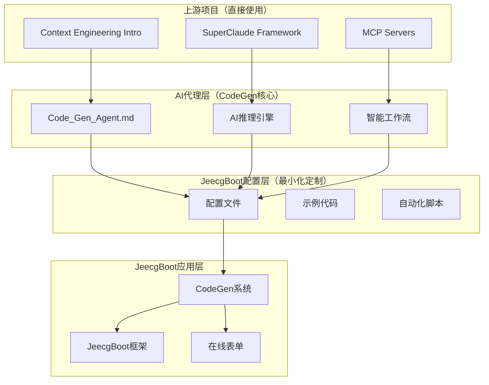

# JeecgBoot AI 赋能方案

## 🎯 项目概述

本项目为 JeecgBoot 框架提供 AI 赋能解决方案，通过集成 Context Engineering Intro 和 SuperClaude Framework 两个开源项目，并深度整合 JeecgBoot CodeGen 系统，实现 AI 辅助开发能力，大幅提升开发效率和代码质量。

## ✨ 核心特性

### 🤖 AI 代理驱动的代码生成

- **CodeGen AI 代理**: 基于 Code_Gen_Agent.md 规范的智能代码生成
- **智能需求分析**: AI 自动分析业务需求，生成标准化字段设计
- **配置文件智能生成**: 自动生成符合 JeecgBoot 规范的 JSON 配置
- **完整工作流自动化**: 从需求分析到代码部署的全流程自动化

### 🔧 专业化工具

- **16 个专业命令**: 覆盖分析、设计、实现、测试、优化等全流程
- **9 个 AI 人格**: 架构师、后端专家、前端专家、安全专家等专业角色
- **MCP 服务器集成**: Context7、Sequential、Magic、Playwright 等增强功能

### 🏗️ JeecgBoot 深度集成

- **AI 增强的 Code_Gen_Guide.py**: 智能参数生成和执行优化
- **标准化表名解析**: AI 辅助的模块和包名生成
- **自动化编译验证**: Maven 编译和前端代码迁移
- **权限系统集成**: 自动权限授权和角色管理
- **模块化开发**: 支持 jeecg-module-\*标准模块结构

## 📁 文件结构

```
JeecgBoot项目/
├── ContextDev/                        # AI赋能开发目录
│   ├── README.md                      # 目录说明文档
│   ├── README_AI_Enhancement.md       # 项目概述
│   ├── Quick_Start_Guide.md           # 快速开始指南（5分钟上手）
│   ├── JeecgBoot_AI_Integration_Guide.md  # 完整集成指南
│   ├── jeecg-ai-config.json          # 项目配置文件
│   ├── jeecg-claude-extension.md     # Claude配置扩展
│   ├── jeecg-examples-structure.md   # 示例代码库结构
│   ├── jeecg-ai-setup.sh             # 一键安装脚本
│   └── jeecg-ai-update.sh            # 上游同步脚本
├── CodeGen/                           # JeecgBoot代码生成系统
│   ├── Code_Gen_Agent.md              # AI代理规范（核心）
│   ├── Code_Gen_Guide.py              # 代码生成执行脚本
│   ├── Code_Gen_Guide.md              # 技术实现指南
│   ├── Code_Gen_Config.json           # 系统配置
│   └── Code_Gen_Guide.json            # 表单模板配置
└── .ai-config/                        # AI配置目录（安装后生成）
    ├── jeecg-ai-config.json           # 项目配置副本
    ├── codegen-ai-config.json         # CodeGen AI配置
    └── .env                            # 环境变量
```

## 🚀 快速开始

### 方式 1: 一键安装（推荐）

```bash
# 下载并执行安装脚本
curl -O https://raw.githubusercontent.com/kyne0116/JeecgBoot/my-custom/ContextDev/jeecg-ai-setup.sh
chmod +x jeecg-ai-setup.sh
./jeecg-ai-setup.sh
```

### 方式 2: 手动安装

```bash
# 1. 安装Context Engineering
git clone https://github.com/coleam00/context-engineering-intro.git

# 2. 安装SuperClaude Framework
uv add SuperClaude
python3 -m SuperClaude install --profile developer

# 3. 配置Claude Code
cp context-engineering-intro/CLAUDE.md ~/.claude/CLAUDE.md
cat jeecg-claude-extension.md >> ~/.claude/CLAUDE.md
```

### 立即测试

在 Claude Code 中执行：

```bash
/sc:analyze "测试JeecgBoot AI集成"
/sc:implement "创建一个用户管理模块"
```

## 📖 使用指南

### 📚 文档导航

- **新手用户**: 阅读 [Quick_Start_Guide.md](Quick_Start_Guide.md)
- **详细配置**: 阅读 [JeecgBoot_AI_Integration_Guide.md](JeecgBoot_AI_Integration_Guide.md)
- **示例代码**: 查看 [jeecg-examples-structure.md](jeecg-examples-structure.md)

### 🎯 典型应用场景

**1. AI 驱动的模块开发（CodeGen 集成）**

```bash
/sc:jeecg-analyze "开发CRM客户管理模块，包含客户基本信息、联系方式、业务状态"
/sc:design "设计客户管理的数据模型和API架构"
/sc:jeecg-config "生成客户管理模块的JSON配置文件"
/sc:codegen "执行完整的代码生成工作流"
/sc:test "生成测试用例"
```

**2. 智能在线表单（CodeGen 增强）**

```bash
/sc:jeecg-analyze "设计产品信息录入表单，包含基本信息、分类、价格、库存等字段"
/sc:jeecg-config "生成产品信息表单的JSON配置"
/sc:codegen "使用CodeGen系统创建在线表单并生成管理代码"
```

**3. 代码优化（包含 CodeGen 生成代码）**

```bash
/sc:improve "优化CodeGen生成的订单查询性能"
/sc:security "检查CodeGen生成代码的权限配置安全性"
/sc:cleanup "清理生成代码中的冗余部分"
```

## 🔄 维护和更新

### 上游项目同步

```bash
# 执行更新脚本（推荐）
./jeecg-ai-update.sh

# 手动更新
cd context-engineering-intro && git pull
uv add SuperClaude --upgrade
```

### 配置备份

```bash
# 查看备份
ls jeecg-backup-*/

# 恢复配置
cp jeecg-backup-latest/* .ai-config/
```

## 📊 效果对比

| 指标           | 传统开发 | AI+CodeGen 辅助 | 提升幅度     |
| -------------- | -------- | --------------- | ------------ |
| 模块开发时间   | 2-3 天   | 0.5-1 天        | **60-75%**   |
| 配置文件生成   | 2-4 小时 | 5-10 分钟       | **90-95%**   |
| 代码生成准确率 | 手工编写 | 95%+            | **显著提升** |
| 代码质量评分   | 70-80 分 | 85-95 分        | **15-20%**   |
| 测试覆盖率     | 60-70%   | 80-90%          | **20-30%**   |
| 文档完整性     | 50-60%   | 90-95%          | **40-45%**   |
| Bug 修复时间   | 2-4 小时 | 30 分钟-1 小时  | **60-75%**   |

## 🏗️ 技术架构

### 核心组件



### 设计原则

1. **最大化上游复用** - 100%使用原生功能，不重复造轮子
2. **AI 代理驱动** - 基于 Code_Gen_Agent.md 规范的智能决策
3. **最小化自定义内容** - 只保留 JeecgBoot 特有的配置
4. **无缝版本同步** - 自动跟随上游更新
5. **零侵入集成** - 不影响现有 JeecgBoot 项目

## 🤝 贡献指南

### 参与贡献

1. Fork 本项目
2. 创建功能分支 (`git checkout -b feature/AmazingFeature`)
3. 提交更改 (`git commit -m 'Add some AmazingFeature'`)
4. 推送到分支 (`git push origin feature/AmazingFeature`)
5. 创建 Pull Request

### 问题反馈

- 🐛 Bug 报告: 使用 GitHub Issues
- 💡 功能建议: 使用 GitHub Discussions
- 📖 文档改进: 直接提交 PR

## 📄 许可证

本项目采用 MIT 许可证 - 查看 [LICENSE](LICENSE) 文件了解详情。

## 🙏 致谢

感谢以下开源项目的支持：

- [Context Engineering Intro](https://github.com/coleam00/context-engineering-intro) - Context Engineering 方法论
- [SuperClaude Framework](https://github.com/SuperClaude-Org/SuperClaude_Framework) - AI 工具框架
- [JeecgBoot](https://github.com/jeecgboot/jeecg-boot) - 低代码开发平台
- [Claude Code](https://claude.ai) - AI 编程助手

## 📞 技术支持

- 📧 邮箱: support@jeecg-ai.com
- 💬 微信群: 扫描二维码加入
- 🌐 官网: https://jeecg-ai.com
- 📚 文档: https://docs.jeecg-ai.com

## 🔗 相关链接

- [JeecgBoot 官网](http://www.jeecg.com)
- [Context Engineering 官方文档](https://github.com/coleam00/context-engineering-intro)
- [SuperClaude Framework 官方文档](https://github.com/SuperClaude-Org/SuperClaude_Framework)
- [Claude Code 使用指南](https://docs.anthropic.com/en/docs/claude-code)
- **[CodeGen 系统文档](../CodeGen/Code_Gen_Guide.md)** - JeecgBoot 代码生成系统
- **[CodeGen AI 代理规范](../CodeGen/Code_Gen_Agent.md)** - AI 代理行为规范

---

**版本**: v2.0.0 (CodeGen 集成版)
**最后更新**: 2024 年 1 月 22 日
**维护者**: JeecgBoot AI 集成团队

🚀 **开始您的 AI 辅助开发之旅，让编程更智能、更高效！**
