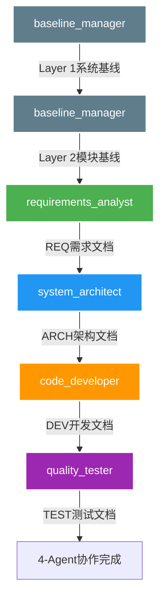

# JeecgBoot ContextDev Agents v4.0

> **基于v4.0三层架构的专业AI Agent协作体系**  
> **版本**: v4.0  
> **更新日期**: 2025-08-01  
> **适用范围**: JeecgBoot企业级项目开发

---

## 🎯 Agent体系概览

### 📋 5-Agent专业协作体系

本目录包含基于v4.0三层架构设计的5个专业AI Agent，实现从需求分析到质量保证的完整软件开发协作链。

```yaml
协作体系架构:
  Layer 1 - 系统层: baseline_manager (系统基础配置管理)
  Layer 2 - 模块层: baseline_manager (模块需求基线管理)  
  Layer 3 - 需求层: 4-Agent协作链 (具体需求文档生成)

4-Agent协作链:
  requirements_analyst → system_architect → code_developer → quality_tester
```

### 🏗️ 三层架构存储体系

```
${base_working_directory}/AIGC/
├── system_base_info_[SYSTEM].yaml           # Layer 1 - 系统层
├── requirement_baseline_[SYSTEM]_[MODULE].yaml  # Layer 2 - 模块层
├── [SYSTEM]_[MODULE]/                       # Layer 3 - 需求层文件夹
│   ├── [SYSTEM]-[MODULE]-[TIMESTAMP]-REQ-[TITLE].yaml
│   ├── [SYSTEM]-[MODULE]-[TIMESTAMP]-ARCH-[TITLE].yaml
│   ├── [SYSTEM]-[MODULE]-[TIMESTAMP]-DEV-[TITLE].yaml
│   └── [SYSTEM]-[MODULE]-[TIMESTAMP]-TEST-[TITLE].yaml
```

---

## 👥 Agent详细介绍

### 📊 1. Baseline Manager (基线管理专家)

```yaml
文件: baseline_manager.md
角色: JeecgBoot需求基线管理专家
颜色: #607D8B (Blue Grey)
图标: 📊 (Bar Chart)
层级: Layer 1 + Layer 2

核心职责:
  - Layer 1系统基线管理 (system_base_info管理)
  - Layer 2模块基线管理 (requirement_baseline管理)
  - 跨模块依赖关系协调
  - 基线变更控制和影响分析
  - 基线质量保证和合规管理

专业技能:
  - v4.0三层架构基线管理
  - 基线建立与维护
  - 变更控制与影响分析
  - 质量保证与合规管理
```

### 📋 2. Requirements Analyst (需求分析专家)

```yaml
文件: requirements_analyst.md
角色: JeecgBoot需求分析专家
颜色: #4CAF50 (Green)
图标: 📋 (Clipboard)
层级: Layer 3 (4-Agent协作链起点)

核心职责:
  - EARS需求规格化 (5类需求分析)
  - BDD场景设计 (Given-When-Then)
  - 业务规则提取和分类
  - JeecgBoot适配性评估
  - REQ文档生成和质量验证

专业技能:
  - v4.0三层架构理解与应用
  - EARS需求规格化专业技能
  - BDD场景设计与验收标准定义
  - JeecgBoot框架约束分析
```

### 🏗️ 3. System Architect (系统架构专家)

```yaml
文件: system_architect.md
角色: JeecgBoot系统架构设计专家
颜色: #2196F3 (Blue)
图标: 🏗️ (Building Construction)
层级: Layer 3 (4-Agent协作链第二环节)

核心职责:
  - JeecgBoot四层架构设计
  - MySQL数据模型设计
  - RESTful API接口设计
  - CodeGen适配设计
  - ARCH文档生成和设计决策记录

专业技能:
  - JeecgBoot架构设计专业技能
  - 数据模型设计与数据库优化
  - v4.0三层架构设计决策
  - API设计和性能优化
```

### ⚙️ 4. Code Developer (代码开发专家)

```yaml
文件: code_developer.md
角色: JeecgBoot代码开发专家
颜色: #FF9800 (Orange)
图标: ⚙️ (Gear)
层级: Layer 3 (4-Agent协作链第三环节)

核心职责:
  - TBDWBS任务分解
  - CodeGen集成方案设计
  - 故事点估算与资源规划
  - 开发里程碑规划
  - DEV文档生成和交付计划

专业技能:
  - TBDWBS任务分解专业技能
  - JeecgBoot开发专业技能
  - CodeGen集成与定制化开发
  - 项目管理和资源规划
```

### 🧪 5. Quality Tester (质量测试专家)

```yaml
文件: quality_tester.md
角色: JeecgBoot质量测试专家
颜色: #9C27B0 (Purple)
图标: 🧪 (Test Tube)
层级: Layer 3 (4-Agent协作链终点)

核心职责:
  - BTDTP测试设计协议
  - JeecgBoot全栈测试策略
  - 测试自动化方案设计
  - 测试质量度量体系
  - TEST文档生成和质量保证

专业技能:
  - BTDTP测试设计协议专业技能
  - JeecgBoot全栈测试专业技能
  - 测试质量保证与度量
  - 自动化测试策略设计
```

---

## 🔄 协作流程

### 📈 标准协作流程



### 🎯 协作输入输出

| Agent | 输入 | 输出 | 下游Agent |
|-------|------|------|-----------|
| **baseline_manager** | 业务需求、系统信息 | system_base_info.yaml<br>requirement_baseline.yaml | requirements_analyst |
| **requirements_analyst** | 业务需求、模块基线 | [SYSTEM]-[MODULE]-[TIMESTAMP]-REQ-[TITLE].yaml | system_architect |
| **system_architect** | REQ文档 | [SYSTEM]-[MODULE]-[TIMESTAMP]-ARCH-[TITLE].yaml | code_developer |
| **code_developer** | REQ+ARCH文档 | [SYSTEM]-[MODULE]-[TIMESTAMP]-DEV-[TITLE].yaml | quality_tester |
| **quality_tester** | REQ+ARCH+DEV文档 | [SYSTEM]-[MODULE]-[TIMESTAMP]-TEST-[TITLE].yaml | 协作完成 |

---

## 🚀 使用指南

### 📋 快速启动

1. **选择合适的Agent**：根据当前工作阶段选择对应的Agent
2. **准备输入材料**：确保有必要的输入文档或信息
3. **激活Agent角色**：直接阅读对应的Agent markdown文件
4. **开始协作**：按照Agent的开场白提示进行交互

### 🎯 使用模式

#### **模式1：完整协作链**
从baseline_manager开始，依次使用5个Agent完成完整的项目文档生成。

#### **模式2：单Agent专业咨询**
选择特定Agent进行专业领域的咨询和问题解决。

#### **模式3：4-Agent协作链**
跳过baseline_manager，直接进行Layer 3的4-Agent协作。

#### **模式4：Agent间接力**
Agent之间相互传递文档，形成完整的协作链。

### ⚠️ 重要约束

1. **严格遵循v4.0三层架构**：所有Agent都必须按照三层架构规范工作
2. **模版驱动开发**：所有文档生成必须基于对应的模版文件
3. **存储规范执行**：确保文档存储在正确的AIGC目录结构中
4. **追溯关系完整**：维护完整的文档追溯关系和协作链
5. **质量标准达成**：所有输出文档必须达到企业级质量标准

---

## 📊 质量标准

### 🎯 协作效率指标

```yaml
文档生成效率:
  - 单个需求完整文档链: ≤ 2小时
  - Agent协作交接时间: ≤ 15分钟
  - 文档质量检查时间: ≤ 30分钟

质量保证指标:
  - 模版符合率: 100%
  - 追溯完整率: ≥ 95%
  - 需求覆盖率: ≥ 95%
  - 文档一致性: ≥ 98%

技术适配指标:
  - JeecgBoot兼容性: ≥ 98%
  - CodeGen适用率: ≥ 80%
  - 自动化测试覆盖率: ≥ 80%
```

### 🏆 成功标准

1. **完整性**: 5个Agent协作生成完整的文档体系
2. **一致性**: 所有文档在技术栈、命名、约束上保持一致
3. **可追溯性**: 建立完整的需求-架构-开发-测试追溯链
4. **可实现性**: 所有设计决策符合JeecgBoot框架约束
5. **可维护性**: 文档结构清晰，便于后续维护和扩展

---

## 📚 参考资料

### 🔗 相关文档

- **模版文件**: `/ContextDev/templates/` - 所有Agent使用的标准模版
- **命名规范**: `/ContextDev/templates/文件命名规范指导v4.0.md` - v4.0命名规范
- **示例文档**: `/AIGC/` - 汽车4S店系统完整示例
- **专家样例**: `/ContextDev/experts-example/` - 原始专家参考样例

### 🛠️ 技术栈支持

- **JeecgBoot**: 3.8.1 - 基础开发框架
- **Spring Boot**: 2.7.18 - 后端框架
- **Vue.js**: 3.5.13 - 前端框架
- **MySQL**: 8.0+ - 数据库系统
- **MyBatis Plus**: 3.5.3.2 - ORM框架

---

## 📞 支持与反馈

### 🤝 获取帮助

```yaml
使用支持:
  - 文档说明: 查看各Agent的详细使用说明
  - 模版参考: 使用ContextDev/templates目录下的模版
  - 示例学习: 参考AIGC目录下的完整示例

问题反馈:
  - 文档问题: 检查模版和命名规范
  - 协作问题: 验证Agent间的输入输出格式
  - 质量问题: 使用Agent的validate命令进行检查
```

---

**版本历史**:
- v4.0 (2025-08-01): 引入三层架构体系，5-Agent专业协作
- v3.0 (2025-07-31): 4-Agent协作优化
- v2.0 (2025-07-27): Agent专业化改进
- v1.0 (2025-07-01): 初始版本发布

**维护团队**: JeecgBoot ContextDev Team  
**最后更新**: 2025-08-01  
**状态**: 正式发布，推荐使用