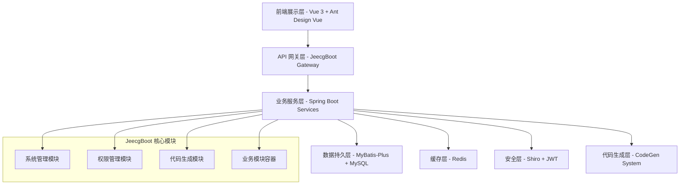

name: "JeecgBoot 系统设计文档模板 v2.0 - Context Engineering 增强版"
description: |

## 模板定位
基于 Context Engineering 最佳实践优化的系统设计模板，确保 AI 编程助手能够获得充分的技术上下文，实现高质量的 JeecgBoot 项目系统设计和架构实现。

## 核心原则
1. **Context is King**: 提供完整的技术栈、架构模式和设计约束
2. **Validation Loops**: 包含可执行的设计验证门槛和检查机制
3. **Information Dense**: 使用 JeecgBoot 平台的具体技术和组件模式
4. **Progressive Success**: 分层次设计验证，从架构到实现
5. **CodeGen Integration**: 强制集成 CodeGen 系统进行设计验证

---

## 🎯 Goal (目标)
基于需求规格设计 JeecgBoot 项目的技术架构和实现方案，为 AI 编程助手提供充分的技术上下文信息，确保设计能够通过 CodeGen 系统和架构验证实现90%+的技术实现成功率。

## 💡 Why (价值和意义)
- **技术价值**: 基于 JeecgBoot 平台优势，确保架构的可实现性和可维护性
- **开发价值**: 通过设计先行，减少开发过程中的技术重构和返工
- **质量价值**: 确保系统架构符合企业级应用的性能、安全和扩展性要求
- **集成价值**: 与现有 JeecgBoot 生态系统无缝集成，最大化平台能力

## 📋 What (具体设计)
### 基本信息
- **项目名称**: [填写项目名称]
- **系统版本**: [填写系统版本]
- **设计负责人**: [填写设计负责人]
- **JeecgBoot 版本**: 3.8.1+
- **技术栈版本**: Spring Boot 2.7.18 + Vue 3.5.13 + Ant Design Vue 4.2.6
- **目标环境**: [开发/测试/生产环境规格]

### 成功标准
- [ ] 架构设计与需求规格完全对应
- [ ] 技术选型符合 JeecgBoot 生态体系
- [ ] 数据库设计遵循 JeecgBoot 规范
- [ ] API 设计符合 JeecgBoot 接口标准
- [ ] 前端设计基于 JeecgBoot Vue3 框架
- [ ] CodeGen 配置设计完整可执行
- [ ] 验证门槛可执行通过

---

## 📚 All Needed Context (所有必需上下文)

### 文档和参考资料
```yaml
# 必读文档 - AI 编程助手必须在上下文中包含这些资源
- doc: PRPs/CLAUDE.md
  why: JeecgBoot AI 编程规范和设计约束
  
- doc: CodeGen/Code_Gen_Agent.md
  why: CodeGen AI 代理规范，理解代码生成的设计要求
  
- doc: ContextDev/templates/REQUIREMENTS_JEECGBOOT.md
  why: 需求规格文档，确保设计与需求的一致性
  critical: 设计必须完全覆盖需求规格中的所有功能点
  
- url: https://context7.com/jeecgboot/jeecgboot
  why: JeecgBoot 技术文档，架构模式和最佳实践
  section: [系统架构、技术栈说明、开发规范]
  
- url: https://deepwiki.com/jeecgboot/JeecgBoot
  why: JeecgBoot 深度解析，核心组件和扩展机制
  
- file: context-engineering-intro/examples/jeecgboot/
  why: 参考现有 JeecgBoot 架构模式和设计实践
  critical: 必须遵循现有的分层架构和组件设计模式

- docfile: ContextDev/templates/PLANNING_JEECGBOOT.md
  why: 项目规划文档，确保设计与规划的一致性
```

### 当前架构约束参考
```bash
# 获取当前 JeecgBoot 项目结构
JeecgBoot/
├── jeecg-boot/                          # 后端 Spring Boot 项目
│   ├── jeecg-boot-base-core/            # 核心框架和工具类
│   ├── jeecg-module-system/             # 系统管理模块
│   │   ├── jeecg-system-api/            # API 定义
│   │   ├── jeecg-system-biz/            # 业务逻辑实现
│   │   └── jeecg-system-start/          # 启动模块
│   └── jeecg-boot-module/               # 业务模块容器
├── jeecgboot-vue3/                      # 前端 Vue 3 项目
│   ├── src/views/                       # 业务页面组件
│   ├── src/components/                  # 公共组件库
│   ├── src/api/                         # API 服务层
│   └── src/store/                       # Pinia 状态管理
└── CodeGen/                             # 代码生成系统
```

### JeecgBoot 核心技术约束
```markdown
# 关键技术约束 - 必须严格遵循
- **后端框架**: Spring Boot 2.7.18，不可使用其他版本
- **数据访问**: MyBatis-Plus 3.5.3.2，必须使用 BaseMapper 和 IService
- **安全框架**: Apache Shiro + JWT，权限注解 @RequiresPermissions
- **前端框架**: Vue 3.5.13 + TypeScript + Vite 6
- **UI 组件**: Ant Design Vue 4.2.6，必须使用 JEECG 封装组件
- **状态管理**: Pinia，禁止使用 Vuex
- **表格组件**: VXE Table，复杂表格必须使用此组件
- **构建工具**: Maven 3.6+ (后端) + Vite 6 (前端)
```

---

## 🏗️ 系统架构设计

### 整体架构模式
基于 JeecgBoot 企业级快速开发平台的分层架构设计：



### 技术栈架构设计
| 架构层级 | 技术选型 | 版本约束 | JeecgBoot 集成方式 | 设计要点 |
|---------|---------|---------|-------------------|---------|
| **前端框架** | Vue 3 + TypeScript | 3.5.13 | JeecgBoot Vue3 脚手架 | 基于 JeecgBoot 组件库设计 |
| **UI 组件** | Ant Design Vue | 4.2.6 | JEECG 封装组件 | 必须使用 JEECG 定制组件 |
| **状态管理** | Pinia | 2.x | JeecgBoot Store 模式 | 遵循 JeecgBoot 状态管理规范 |
| **路由管理** | Vue Router | 4.x | 动态路由 + 权限控制 | 集成 JeecgBoot 权限系统 |
| **HTTP 客户端** | Axios | 1.x | JeecgBoot 封装 defHttp | 使用统一的 HTTP 工具类 |
| **构建工具** | Vite | 6.x | JeecgBoot Vite 配置 | 基于 JeecgBoot 优化配置 |
| **后端框架** | Spring Boot | 2.7.18 | JeecgBoot 定制版 | 集成 JeecgBoot 核心组件 |
| **数据访问** | MyBatis-Plus | 3.5.3.2 | JeecgBoot 增强 | 使用 JeecgBoot 基础类 |
| **安全框架** | Shiro + JWT | - | JeecgBoot 权限体系 | 集成完整权限管理 |
| **数据库** | MySQL | 8.0+ | JeecgBoot 数据结构 | 遵循 JeecgBoot 表结构规范 |
| **缓存系统** | Redis | 7.x | JeecgBoot 缓存策略 | 集成 JeecgBoot 缓存组件 |

### 模块架构设计
```yaml
# 基于 JeecgBoot 的模块设计架构
JeecgBoot_Architecture:
  Backend_Modules:
    jeecg-boot-base-core:
      purpose: "核心框架和通用工具"
      components: ["通用工具类", "基础配置", "核心注解", "异常处理"]
      design_constraint: "不可修改，只能扩展"
      
    jeecg-module-system:
      purpose: "系统管理核心模块" 
      components: ["用户管理", "角色管理", "权限管理", "菜单管理"]
      design_constraint: "可扩展，不建议修改核心逻辑"
      
    jeecg-module-[custom]:
      purpose: "自定义业务模块"
      package_structure: "org.jeecg.modules.[module].[submodule]"
      components: ["Controller", "Service", "Mapper", "Entity", "VO/DTO"]
      design_constraint: "必须遵循 JeecgBoot 分层规范"
      
  Frontend_Modules:
    src/views/[module]:
      purpose: "业务页面组件"
      components: ["List.vue", "Modal.vue", "Form.vue"]
      design_constraint: "必须使用 JeecgBoot 组件模板"
      
    src/api/[module]:
      purpose: "API 服务层"
      components: ["接口定义", "请求封装", "响应处理"]
      design_constraint: "使用 defHttp 统一请求工具"
      
    src/components/[module]:
      purpose: "业务组件库"
      components: ["自定义组件", "业务逻辑组件"]
      design_constraint: "基于 Ant Design Vue 组件扩展"
```

---

## 🗃️ 数据库架构设计

### 数据库设计规范
基于 JeecgBoot 数据库设计标准：

```yaml
# JeecgBoot 数据库设计约束
Database_Design_Rules:
  Table_Naming:
    pattern: "us_{module_name}_{submodule}_{entity_name}"
    examples: 
      - "us_system_user_info"
      - "us_order_product_detail"
      - "us_finance_payment_record"
    validation: "必须通过 CodeGen 表名验证"
    
  System_Fields:
    required_fields:
      - name: "id" 
        type: "varchar(32)"
        constraint: "PRIMARY KEY"
        comment: "主键ID"
        
      - name: "create_by"
        type: "varchar(50)" 
        constraint: "NOT NULL"
        comment: "创建人"
        
      - name: "create_time"
        type: "datetime"
        constraint: "DEFAULT CURRENT_TIMESTAMP"
        comment: "创建时间"
        
      - name: "update_by"
        type: "varchar(50)"
        comment: "更新人"
        
      - name: "update_time" 
        type: "datetime"
        constraint: "ON UPDATE CURRENT_TIMESTAMP"
        comment: "更新时间"
        
      - name: "sys_org_code"
        type: "varchar(64)"
        comment: "所属部门编码"
        
      - name: "del_flag"
        type: "tinyint(1)"
        constraint: "DEFAULT 0"
        comment: "删除标志(0:正常,1:删除)"
        
  Index_Strategy:
    primary_index: "id (主键索引)"
    business_indexes: 
      - "idx_create_time (创建时间索引)"
      - "idx_del_flag (删除标志索引)"
      - "idx_sys_org_code (部门权限索引)"
    custom_indexes: "[根据业务查询需求设计]"
```

### 数据模型设计模板
```sql
-- JeecgBoot 标准表结构模板
CREATE TABLE `us_{module}_{submodule}_{entity}` (
  `id` varchar(32) NOT NULL COMMENT '主键ID',
  
  -- 业务字段区域 (根据需求规格设计)
  `{business_field_1}` varchar(100) DEFAULT NULL COMMENT '{字段说明}',
  `{business_field_2}` decimal(10,2) DEFAULT NULL COMMENT '{字段说明}',
  `{business_field_3}` int(11) DEFAULT NULL COMMENT '{字段说明}',
  `{business_field_4}` text COMMENT '{字段说明}',
  `status` tinyint(1) DEFAULT '1' COMMENT '状态(1:启用,0:禁用)',
  
  -- JeecgBoot 系统必需字段 (不可修改)
  `create_by` varchar(50) NOT NULL COMMENT '创建人',
  `create_time` datetime DEFAULT CURRENT_TIMESTAMP COMMENT '创建时间',
  `update_by` varchar(50) DEFAULT NULL COMMENT '更新人',
  `update_time` datetime DEFAULT NULL ON UPDATE CURRENT_TIMESTAMP COMMENT '更新时间',
  `sys_org_code` varchar(64) DEFAULT NULL COMMENT '所属部门编码',
  `del_flag` tinyint(1) DEFAULT '0' COMMENT '删除标志(0:正常,1:删除)',
  
  -- 索引设计
  PRIMARY KEY (`id`),
  KEY `idx_create_time` (`create_time`),
  KEY `idx_del_flag` (`del_flag`),
  KEY `idx_sys_org_code` (`sys_org_code`),
  KEY `idx_status` (`status`),
  KEY `idx_{business_key}` (`{business_field}`)  -- 业务索引
) ENGINE=InnoDB DEFAULT CHARSET=utf8mb4 COMMENT='{表功能说明}';
```

### 数据关系设计
```yaml
# JeecgBoot 数据关系设计模式
Relationship_Design:
  OneToMany:
    pattern: "主表 -> 从表通过外键关联"
    foreign_key_naming: "{parent_table_entity}_id"
    cascade_strategy: "逻辑删除，不使用物理级联"
    example:
      parent: "us_order_main_order"
      child: "us_order_detail_item" 
      foreign_key: "order_id"
      
  ManyToMany:
    pattern: "通过中间表实现多对多关系"
    join_table_naming: "us_{module}_{entity_a}_{entity_b}_relation"
    design_principle: "避免复杂多对多，优先使用一对多设计"
    
  Reference_System_Tables:
    user_reference: 
      table: "sys_user"
      field: "create_by, update_by"
      design: "通过用户ID关联，不使用外键约束"
      
    org_reference:
      table: "sys_depart" 
      field: "sys_org_code"
      design: "通过部门编码关联，支持数据权限"
```

---

## 🔌 API 接口架构设计

### JeecgBoot API 设计规范
```yaml
# 基于 JeecgBoot 的 API 设计标准
API_Design_Standards:
  URL_Pattern:
    base_path: "/jeecg-boot/{module}/{submodule}"
    examples:
      - "/jeecg-boot/system/user/list"
      - "/jeecg-boot/order/product/add" 
      - "/jeecg-boot/finance/payment/edit"
    
  HTTP_Methods:
    GET: "查询操作 (list, queryById)"
    POST: "新增操作 (add, save)"
    PUT: "更新操作 (edit, update)"
    DELETE: "删除操作 (delete, deleteBatch)"
    
  Response_Format:
    success_response:
      structure: "Result<T> 统一响应格式"
      fields: ["success", "message", "code", "result", "timestamp"]
      
    error_response:
      structure: "Result<T> 统一错误格式"
      fields: ["success: false", "message", "code", "result: null"]
      
  Permission_Control:
    annotation: "@RequiresPermissions"
    pattern: "{module}:{submodule}:{operation}"
    examples: ["system:user:list", "order:product:add"]
```

### 核心接口设计模板
```java
// JeecgBoot Controller 设计模板
@RestController
@RequestMapping("/jeecg-boot/{module}/{submodule}")
@Api(tags = "{业务模块}管理")
@Slf4j
public class {Module}{Submodule}Controller extends JeecgController<{Entity}, I{Module}{Submodule}Service> {

    @Autowired
    private I{Module}{Submodule}Service {module}{Submodule}Service;

    /**
     * 分页列表查询
     */
    @GetMapping(value = "/list")
    @ApiOperation(value = "{业务对象}-分页列表查询", notes = "{业务对象}-分页列表查询")
    @RequiresPermissions("{module}:{submodule}:list")
    public Result<IPage<{Entity}>> queryPageList({Entity} {entity},
                                                 @RequestParam(name="pageNo", defaultValue="1") Integer pageNo,
                                                 @RequestParam(name="pageSize", defaultValue="10") Integer pageSize,
                                                 HttpServletRequest req) {
        QueryWrapper<{Entity}> queryWrapper = QueryGenerator.initQueryWrapper({entity}, req.getParameterMap());
        Page<{Entity}> page = new Page<{Entity}>(pageNo, pageSize);
        IPage<{Entity}> pageList = {module}{Submodule}Service.page(page, queryWrapper);
        return Result.OK(pageList);
    }

    /**
     * 添加
     */
    @PostMapping(value = "/add")
    @ApiOperation(value = "{业务对象}-添加", notes = "{业务对象}-添加")
    @RequiresPermissions("{module}:{submodule}:add")
    public Result<String> add(@RequestBody {Entity} {entity}) {
        {module}{Submodule}Service.save({entity});
        return Result.OK("添加成功！");
    }

    /**
     * 编辑
     */
    @RequestMapping(value = "/edit", method = {RequestMethod.PUT, RequestMethod.POST})
    @ApiOperation(value = "{业务对象}-编辑", notes = "{业务对象}-编辑")
    @RequiresPermissions("{module}:{submodule}:edit")
    public Result<String> edit(@RequestBody {Entity} {entity}) {
        {module}{Submodule}Service.updateById({entity});
        return Result.OK("编辑成功!");
    }

    /**
     * 通过id删除
     */
    @DeleteMapping(value = "/delete")
    @ApiOperation(value = "{业务对象}-通过id删除", notes = "{业务对象}-通过id删除")
    @RequiresPermissions("{module}:{submodule}:delete")
    public Result<String> delete(@RequestParam(name="id") String id) {
        {module}{Submodule}Service.removeById(id);
        return Result.OK("删除成功!");
    }

    /**
     * 批量删除
     */
    @DeleteMapping(value = "/deleteBatch")
    @ApiOperation(value = "{业务对象}-批量删除", notes = "{业务对象}-批量删除")
    @RequiresPermissions("{module}:{submodule}:deleteBatch")
    public Result<String> deleteBatch(@RequestParam(name="ids") String ids) {
        this.{module}{Submodule}Service.removeByIds(Arrays.asList(ids.split(",")));
        return Result.OK("批量删除成功!");
    }

    /**
     * 通过id查询
     */
    @GetMapping(value = "/queryById")
    @ApiOperation(value = "{业务对象}-通过id查询", notes = "{业务对象}-通过id查询")
    public Result<{Entity}> queryById(@RequestParam(name="id") String id) {
        {Entity} {entity} = {module}{Submodule}Service.getById(id);
        if({entity} == null) {
            return Result.error("未找到对应数据");
        }
        return Result.OK({entity});
    }

    /**
     * 导出excel
     */
    @RequestMapping(value = "/exportXls")
    @RequiresPermissions("{module}:{submodule}:exportXls")
    public ModelAndView exportXls(HttpServletRequest request, {Entity} {entity}) {
        return super.exportXls(request, {entity}, {Entity}.class, "{业务对象}");
    }

    /**
     * 通过excel导入数据
     */
    @RequestMapping(value = "/importExcel", method = RequestMethod.POST)
    @RequiresPermissions("{module}:{submodule}:importExcel")
    public Result<?> importExcel(HttpServletRequest request, HttpServletResponse response) {
        return super.importExcel(request, response, {Entity}.class);
    }
}
```

### API 响应格式设计
```yaml
# JeecgBoot 统一响应格式
Response_Format:
  Success_Response:
    structure:
      success: true
      message: "操作成功"
      code: 200
      result: 
        - "数据对象 (单个对象或分页对象)"
      timestamp: 1640995200000
      
  Pagination_Response:
    structure:
      success: true
      message: "查询成功"
      code: 200
      result:
        records: [] # 数据记录数组
        total: 100  # 总记录数
        size: 10    # 每页大小
        current: 1  # 当前页码
        pages: 10   # 总页数
      timestamp: 1640995200000
      
  Error_Response:
    structure:
      success: false
      message: "错误描述信息"
      code: 500    # 或其他错误码
      result: null
      timestamp: 1640995200000
```

---

## 🎨 前端架构设计

### JeecgBoot Vue3 架构设计
```yaml
# 基于 JeecgBoot Vue3 的前端架构
Frontend_Architecture:
  Project_Structure:
    src/views/{module}:
      purpose: "业务页面组件"
      components:
        - "{Module}List.vue"      # 列表页面
        - "{Module}Modal.vue"     # 弹窗组件  
        - "{Module}Form.vue"      # 表单组件
        - "components/"           # 子组件目录
      design_pattern: "页面组件 + 业务组件分离"
      
    src/api/{module}:
      purpose: "API 服务封装"
      files:
        - "{module}.ts"           # 接口定义文件
      design_pattern: "基于 defHttp 统一封装"
      
    src/components/{module}:
      purpose: "业务组件库"
      design_pattern: "可复用业务组件"
      
  Component_Design_Rules:
    List_Component:
      template: "JeecgBoot 列表页面模板"
      features: ["查询条件", "操作按钮", "数据表格", "分页组件"]
      dependencies: ["BasicTable", "TableAction", "PageWrapper"]
      
    Modal_Component:
      template: "JeecgBoot 弹窗模板"
      features: ["表单验证", "提交处理", "状态管理"]
      dependencies: ["BasicModal", "BasicForm"]
      
    Form_Component:
      template: "JeecgBoot 表单模板"
      features: ["字段验证", "数据绑定", "提交处理"]
      dependencies: ["BasicForm", "FormItem"]
```

### 前端组件设计模板
```vue
<!-- JeecgBoot Vue3 列表组件模板 -->
<template>
  <PageWrapper dense contentFullHeight contentClass="flex">
    <div class="w-full">
      <!-- 查询区域 -->
      <div class="jeecg-basic-table-form-container">
        <BasicForm @register="registerForm" />
      </div>
      
      <!-- 表格区域 -->
      <div class="jeecg-basic-table">
        <BasicTable @register="registerTable" :rowSelection="rowSelection">
          <!-- 表格头部工具栏 -->
          <template #tableTitle>
            <a-button type="primary" @click="handleAdd" preIcon="ant-design:plus-outlined"> 新增</a-button>
            <a-button type="primary" @click="handleBatchDelete" preIcon="ant-design:delete-outlined"> 删除</a-button>
            <a-dropdown v-if="selectedRowKeys.length > 0">
              <template #overlay>
                <a-menu>
                  <a-menu-item key="1" @click="batchHandleDelete">
                    <Icon icon="ant-design:delete-outlined" />
                    删除
                  </a-menu-item>
                </a-menu>
              </template>
              <a-button>批量操作
                <Icon icon="mdi:chevron-down" />
              </a-button>
            </a-dropdown>
          </template>
          
          <!-- 操作列 -->
          <template #action="{ record }">
            <TableAction
              :actions="[
                {
                  icon: 'clarity:note-edit-line',
                  onClick: handleEdit.bind(null, record),
                },
                {
                  icon: 'ant-design:delete-outlined',
                  color: 'error',
                  popConfirm: {
                    title: '是否确认删除',
                    placement: 'left',
                    confirm: handleDelete.bind(null, record),
                  },
                },
              ]"
            />
          </template>
        </BasicTable>
      </div>
      
      <!-- 表单弹窗 -->
      <{Module}Modal @register="registerModal" @success="handleSuccess" />
    </div>
  </PageWrapper>
</template>

<script lang="ts" setup>
  import { ref, reactive } from 'vue';
  import { BasicTable, useTable, TableAction } from '/@/components/Table';
  import { BasicForm, useForm } from '/@/components/Form/index';
  import { useModal } from '/@/components/Modal';
  import { useListPage } from '/@/hooks/system/useListPage';
  import {Module}Modal from './components/{Module}Modal.vue';
  import { columns, searchFormSchema } from './{module}.data';
  import { list, deleteOne, batchDelete } from './{module}.api';

  const checkedKeys = ref<Array<string | number>>([]);
  
  // 列表页面配置
  const { prefixCls, tableContext, onExportXls, onImportXls } = useListPage({
    tableProps: {
      title: '{业务对象}',
      api: list,
      columns,
      canResize: false,
      formConfig: {
        labelWidth: 120,
        schemas: searchFormSchema,
        autoSubmitOnEnter: true,
      },
      actionColumn: {
        width: 120,
        fixed: 'right',
      },
    },
    exportConfig: {
      name: "{业务对象}列表",
      url: "/jeecg-boot/{module}/{submodule}/exportXls",
    },
    importConfig: {
      url: "/jeecg-boot/{module}/{submodule}/importExcel",
    },
  });

  const [registerTable, { reload, updateTableDataRecord }] = tableContext;

  // 表单配置
  const [registerForm, { getFieldsValue }] = useForm({
    labelWidth: 120,
    schemas: searchFormSchema,
    autoSubmitOnEnter: true,
  });

  // 弹窗配置
  const [registerModal, { openModal }] = useModal();
  
  /**
   * 新增事件
   */
  function handleAdd() {
    openModal(true, {
      isUpdate: false,
    });
  }
  
  /**
   * 编辑事件
   */
  function handleEdit(record: Recordable) {
    openModal(true, {
      record,
      isUpdate: true,
    });
  }
  
  /**
   * 删除事件
   */
  async function handleDelete(record) {
    await deleteOne({ id: record.id }, handleSuccess);
  }
  
  /**
   * 批量删除事件
   */
  async function batchHandleDelete() {
    await batchDelete({ ids: checkedKeys.value }, handleSuccess);
  }
  
  /**
   * 成功回调
   */
  function handleSuccess() {
    (checkedKeys.value = []) && reload();
  }
  
  /**
   * 操作栏
   */
  function getTableAction(record) {
    return [
      {
        label: '编辑',
        onClick: handleEdit.bind(null, record),
      }
    ];
  }
</script>
```

### API 服务设计模板
```typescript
// JeecgBoot API 服务设计模板
import { defHttp } from '/@/utils/http/axios';
import { useMessage } from '/@/hooks/web/useMessage';

const { createConfirm } = useMessage();

enum Api {
  list = '/jeecg-boot/{module}/{submodule}/list',
  save = '/jeecg-boot/{module}/{submodule}/add', 
  edit = '/jeecg-boot/{module}/{submodule}/edit',
  deleteOne = '/jeecg-boot/{module}/{submodule}/delete',
  deleteBatch = '/jeecg-boot/{module}/{submodule}/deleteBatch',
  importExcel = '/jeecg-boot/{module}/{submodule}/importExcel',
  exportXls = '/jeecg-boot/{module}/{submodule}/exportXls',
}

/**
 * 导出api
 */
export const getExportUrl = Api.exportXls;

/**
 * 导入api
 */
export const getImportUrl = Api.importExcel;

/**
 * 列表接口
 */
export const list = (params) => defHttp.get({ url: Api.list, params });

/**
 * 删除单个
 */
export const deleteOne = (params, handleSuccess) => {
  return defHttp.delete({ url: Api.deleteOne, params }, { joinParamsToUrl: true }).then(() => {
    handleSuccess();
  });
};

/**
 * 批量删除
 */
export const batchDelete = (params, handleSuccess) => {
  createConfirm({
    iconType: 'warning',
    title: '确认删除',
    content: '是否删除选中数据',
    okText: '确认',
    cancelText: '取消',
    onOk: () => {
      return defHttp.delete({ url: Api.deleteBatch, data: params }, { joinParamsToUrl: true }).then(() => {
        handleSuccess();
      });
    },
  });
};

/**
 * 保存或者更新
 */
export const saveOrUpdate = (params, isUpdate) => {
  const url = isUpdate ? Api.edit : Api.save;
  return defHttp.post({ url: url, params }, { isTransformResponse: false });
};
```

---

## 🔒 安全架构设计

### JeecgBoot 安全设计模式
```yaml
# 基于 JeecgBoot 的安全架构设计
Security_Architecture:
  Authentication:
    framework: "Apache Shiro + JWT"
    token_strategy: "JWT 令牌认证"
    session_management: "无状态会话管理"
    login_process:
      1. "用户提交登录凭据"
      2. "Shiro 验证用户信息" 
      3. "生成 JWT 令牌"
      4. "返回令牌给客户端"
      5. "客户端存储令牌到 localStorage"
      
  Authorization:
    permission_model: "RBAC (基于角色的访问控制)"
    permission_annotation: "@RequiresPermissions"
    data_permission: "@DataScope 数据权限注解"
    menu_permission: "动态菜单权限控制"
    
  Security_Layers:
    Frontend_Security:
      - "路由守卫 (Router Guards)"
      - "组件权限指令 (v-auth)"
      - "菜单权限控制"
      - "按钮权限控制"
      
    Backend_Security:
      - "JWT 令牌验证"
      - "方法级权限注解"
      - "数据权限过滤"
      - "接口访问控制"
      
    Data_Security:
      - "敏感数据加密存储"
      - "SQL 注入防护 (MyBatis-Plus)"
      - "XSS 攻击防护"
      - "CSRF 令牌保护"
```

### 权限控制设计实现
```java
// JeecgBoot 权限控制设计模板
@RestController
@RequestMapping("/jeecg-boot/{module}/{submodule}")
@Api(tags = "{业务模块}管理")
public class {Module}Controller {

    /**
     * 权限控制设计模式
     */
    @RequiresPermissions("{module}:{submodule}:list")
    @GetMapping("/list")
    public Result<IPage<{Entity}>> list({Entity} {entity},
                                        @RequestParam(name="pageNo", defaultValue="1") Integer pageNo,
                                        @RequestParam(name="pageSize", defaultValue="10") Integer pageSize,
                                        HttpServletRequest req) {
        // 数据权限控制
        QueryWrapper<{Entity}> queryWrapper = QueryGenerator.initQueryWrapper({entity}, req.getParameterMap());
        
        // 添加数据权限过滤
        String username = JwtUtil.getUserNameByToken(req);
        queryWrapper.eq("create_by", username); // 示例：只能查看自己创建的数据
        
        Page<{Entity}> page = new Page<{Entity}>(pageNo, pageSize);
        IPage<{Entity}> pageList = {entity}Service.page(page, queryWrapper);
        return Result.OK(pageList);
    }

    /**
     * 新增权限控制
     */
    @RequiresPermissions("{module}:{submodule}:add")
    @PostMapping("/add")
    public Result<String> add(@RequestBody {Entity} {entity}, HttpServletRequest req) {
        // 自动设置创建人信息
        String username = JwtUtil.getUserNameByToken(req);
        {entity}.setCreateBy(username);
        {entity}.setCreateTime(new Date());
        
        {entity}Service.save({entity});
        return Result.OK("添加成功！");
    }

    /**
     * 编辑权限控制  
     */
    @RequiresPermissions("{module}:{submodule}:edit")
    @PutMapping("/edit")
    public Result<String> edit(@RequestBody {Entity} {entity}, HttpServletRequest req) {
        // 数据权限验证：只能编辑自己的数据
        String username = JwtUtil.getUserNameByToken(req);
        {Entity} existEntity = {entity}Service.getById({entity}.getId());
        
        if (existEntity == null) {
            return Result.error("数据不存在");
        }
        
        if (!existEntity.getCreateBy().equals(username)) {
            return Result.error("无权限编辑此数据"); 
        }
        
        // 自动设置更新人信息
        {entity}.setUpdateBy(username);
        {entity}.setUpdateTime(new Date());
        
        {entity}Service.updateById({entity});
        return Result.OK("编辑成功!");
    }
}
```

---

## ⚡ 性能架构设计

### JeecgBoot 性能优化策略
```yaml
# 基于 JeecgBoot 的性能架构设计
Performance_Architecture:
  Database_Optimization:
    connection_pool: "HikariCP 高性能连接池"
    query_optimization: "MyBatis-Plus 查询优化"
    index_strategy: "基于业务查询的索引设计"
    pagination: "MyBatis-Plus 分页查询优化"
    
  Cache_Strategy:
    L1_Cache: "MyBatis 一级缓存 (Session级别)"
    L2_Cache: "Redis 分布式缓存"
    cache_patterns:
      - "查询结果缓存"
      - "数据字典缓存" 
      - "用户权限缓存"
      - "热点数据缓存"
      
  Frontend_Optimization:
    code_splitting: "基于路由的代码分割"
    lazy_loading: "组件懒加载"
    bundle_optimization: "Vite 构建优化"
    asset_optimization: "静态资源优化"
    
  API_Optimization:
    response_compression: "响应数据压缩"
    result_pagination: "结果集分页"
    query_optimization: "数据库查询优化"
    cache_strategy: "接口缓存策略"
```

### 性能监控设计
```yaml
# JeecgBoot 性能监控设计
Performance_Monitoring:
  Database_Metrics:
    - "SQL 执行时间监控"
    - "数据库连接池状态"
    - "慢查询日志分析"
    - "数据库锁等待监控"
    
  Application_Metrics:
    - "JVM 内存使用情况"
    - "GC 垃圾回收监控"
    - "线程池使用状态"
    - "接口响应时间统计"
    
  Frontend_Metrics:
    - "页面加载时间"
    - "首屏渲染时间"
    - "组件渲染性能"
    - "网络请求时间"
    
  Performance_Targets:
    database_response: "< 500ms"
    api_response: "< 1s"
    page_load: "< 3s"
    concurrent_users: "> 1000"
```

---

## 🔄 验证循环 (Validation Loop)

### Level 1: 架构设计验证
```bash
# 运行这些检查确保架构设计正确

# 1. JeecgBoot 项目结构验证
echo "验证 JeecgBoot 项目结构完整性..."
find . -name "jeecg-boot" -type d
find . -name "jeecgboot-vue3" -type d

# 2. 技术栈版本验证
echo "验证技术栈版本兼容性..."
mvn dependency:tree | grep spring-boot
cd jeecgboot-vue3 && npm list vue

# 3. 数据库连接验证
echo "验证数据库连接配置..."
python3 CodeGen/Code_Gen_Guide.py --test-connection

# 预期结果: 所有组件版本兼容，数据库连接正常
```

### Level 2: 代码生成验证  
```bash
# 验证 CodeGen 系统与设计的兼容性

# 1. CodeGen 配置验证
python3 CodeGen/Code_Gen_Guide.py --validate-config

# 2. 表结构设计验证
python3 CodeGen/Code_Gen_Guide.py --validate-table-name us_{module}_{entity}

# 3. 模块架构验证
echo "验证模块结构是否符合 JeecgBoot 规范..."
find jeecg-boot -name "jeecg-module-*" -type d

# 4. 前端架构验证
echo "验证前端项目结构..."
find jeecgboot-vue3/src -name "api" -type d
find jeecgboot-vue3/src -name "views" -type d

# 预期结果: CodeGen 配置有效，架构结构符合规范
```

### Level 3: 集成架构验证
```bash
# 验证整体架构集成

# 1. 后端编译验证
echo "验证后端架构编译..."
mvn clean compile -Dmaven.test.skip=true

# 2. 前端构建验证
echo "验证前端架构构建..."
cd jeecgboot-vue3 && npm run build

# 3. API 接口设计验证
echo "验证 API 接口设计规范..."
grep -r "@RequiresPermissions" jeecg-boot/jeecg-module-*/src --include="*.java"

# 4. 数据库架构验证
echo "验证数据库架构设计..."
mysql -u root -p -e "SHOW TABLES LIKE 'us_%';"

# 预期结果: 编译构建成功，接口规范正确，数据库架构完整
```

## ✅ 最终验收清单

### 架构设计验收
- [ ] 整体架构符合 JeecgBoot 设计规范
- [ ] 技术栈选型与 JeecgBoot 版本兼容
- [ ] 模块架构遵循 JeecgBoot 分层原则
- [ ] 数据库设计符合 JeecgBoot 标准
- [ ] API 设计遵循 JeecgBoot 接口规范
- [ ] 前端架构基于 JeecgBoot Vue3 框架
- [ ] 安全架构集成 JeecgBoot 权限体系
- [ ] 性能设计满足企业级应用要求

### CodeGen 集成验收
- [ ] CodeGen 配置参数设计完整
- [ ] 表结构设计支持 CodeGen 生成
- [ ] 实体类设计符合 JeecgBoot 规范
- [ ] Controller 设计模板完整可用
- [ ] 前端组件设计模板完整可用
- [ ] API 服务设计模板完整可用

### 技术实现验收
- [ ] 后端架构编译构建成功
- [ ] 前端架构构建部署成功
- [ ] 数据库架构创建成功
- [ ] 权限集成测试通过
- [ ] 性能基准测试达标
- [ ] 安全扫描测试通过

### 文档质量验收
- [ ] 架构设计文档完整清晰
- [ ] 技术实现指导详细准确
- [ ] 验证门槛可执行通过
- [ ] 与需求规格文档一致
- [ ] 为开发实现提供充分指导

---

## ⚠️ 反模式警告 (Anti-Patterns)

```markdown
❌ **严禁的设计做法**:
- 偏离 JeecgBoot 架构模式，使用非兼容技术栈
- 不遵循 JeecgBoot 分层设计，破坏架构一致性
- 绕过 JeecgBoot 权限体系，自建认证授权机制
- 不使用 JeecgBoot 统一响应格式，自定义 API 格式
- 忽略 JeecgBoot 数据库设计规范，使用非标准表结构
- 不集成 CodeGen 系统，手工编写所有代码
- 不考虑 JeecgBoot 升级兼容性，深度定制核心组件

⚠️ **常见设计错误**:
- 架构设计脱离实际需求，过度设计或设计不足
- 忽略 JeecgBoot 平台约束，设计无法实现的架构
- 不考虑性能和扩展性，设计存在性能瓶颈
- 忽略安全性设计，权限控制不完整
- 不考虑运维部署，架构难以维护
```

---

## 📊 信心评分

**架构设计成功率评估**: [8-10]/10

**高信心度原因**:
- ✅ 严格基于 JeecgBoot 平台架构设计
- ✅ 集成 Context Engineering 最佳实践
- ✅ 包含完整的技术验证循环
- ✅ 遵循 JeecgBoot 所有设计规范
- ✅ 提供详细的实现模板和示例
- ✅ 明确的反模式警告和约束

**风险因素**:
- ⚠️ 复杂业务逻辑的架构适配性
- ⚠️ 大数据量场景的性能架构优化
- ⚠️ 与第三方系统集成的架构兼容性

---

## 📋 相关文档链接

- **需求规格文档**: `REQUIREMENTS_JEECGBOOT.md`
- **项目规划文档**: `PLANNING_JEECGBOOT.md`
- **任务管理文档**: `TASK_JEECGBOOT.md`
- **测试计划文档**: `TESTING_JEECGBOOT.md`
- **AI编程规范**: `PRPs/CLAUDE.md`
- **CodeGen指南**: `CodeGen/Code_Gen_Agent.md`

---

**文档状态**: [设计中/评审中/已确认]  
**评估日期**: [填写日期]  
**负责人**: [填写负责人]  
**信心评分**: [8-10]/10