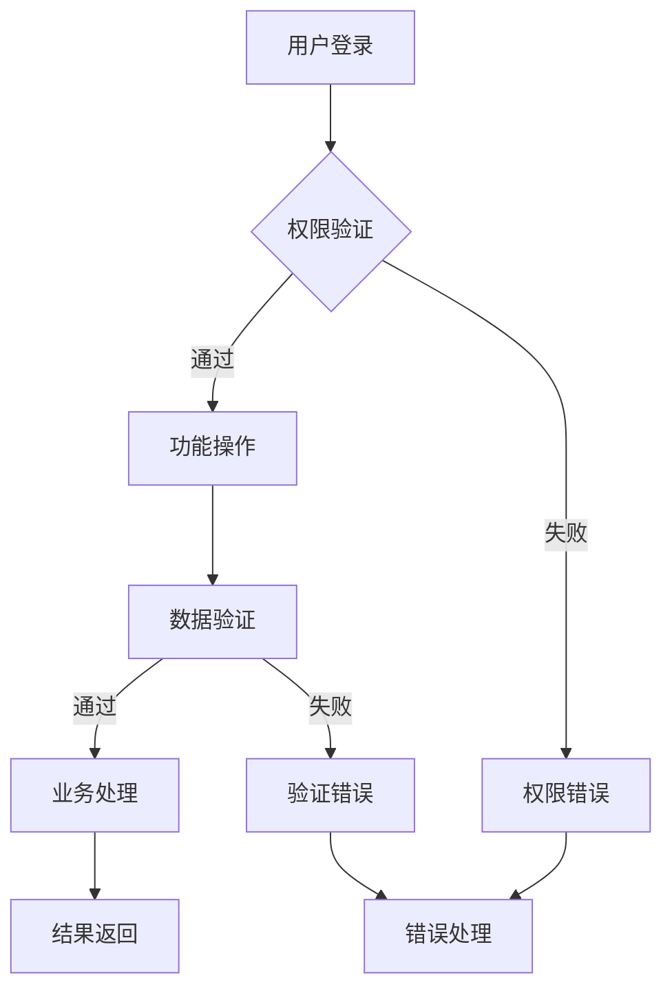

name: "JeecgBoot 需求规格文档模板 v2.0 - Context Engineering 增强版"
description: |

## 模板定位

基于 Context Engineering 最佳实践优化的需求分析模板，确保 AI 编程助手能够获得充分上下文，实现高质量的 JeecgBoot 项目需求分析和实现。

## 核心原则

1. **Context is King**: 提供所有必要的文档、示例和注意事项
2. **Validation Loops**: 包含可执行的验证门槛和检查机制
3. **Information Dense**: 使用 JeecgBoot 代码库的关键词和模式
4. **Progressive Success**: 分步骤成功，先验证需求，再实现功能
5. **CodeGen Integration**: 强制集成 CodeGen 系统进行代码生成

---

## 🎯 Goal (目标)

定义和分析 JeecgBoot 项目的业务需求，为 AI 编程助手提供充分的上下文信息，确保需求能够通过 CodeGen 系统和复杂业务逻辑开发实现 90%+的一次性成功率。

## 💡 Why (价值和意义)

- **业务价值**: [描述通过该功能模块解决的具体业务问题]
- **技术价值**: 基于 JeecgBoot 平台的快速开发能力，提升开发效率
- **用户价值**: [描述最终用户获得的价值和体验提升]
- **系统集成**: 与现有 JeecgBoot 系统模块的协同价值

## 📋 What (具体需求)

### 基本信息

- **项目名称**: [填写项目名称]
- **模块名称**: [填写模块名称，遵循 jeecg-module-{domain} 规范]
- **业务领域**: [填写业务领域，如：财务管理、人力资源、客户关系等]
- **负责人**: [填写负责人]
- **预计工期**: [填写预计工期]
- **表名前缀**: [填写表名前缀，遵循 us_{module}_{entity} 规范]

### 成功标准

- [ ] 需求清晰完整，无歧义
- [ ] 业务流程逻辑正确
- [ ] 数据模型设计合理
- [ ] 权限模型设计完整
- [ ] 与现有系统集成方案明确
- [ ] CodeGen 配置参数准确
- [ ] 验证门槛可执行

---

## 📚 All Needed Context (所有必需上下文)

### 文档和参考资料

```yaml
# 必读文档 - AI 编程助手必须在上下文中包含这些资源
- doc: PRPs/CLAUDE.md
- examples: PRPs/examples/jeecgboot/ # JeecgBoot示例代码集合
  why: JeecgBoot AI 编程规范和行为约束

- doc: CodeGen/Code_Gen_Agent.md
  why: CodeGen AI 代理规范，理解代码生成流程

- url: https://context7.com/jeecgboot/jeecgboot
  why: JeecgBoot 技术文档，最佳实践和配置说明
  section: [指定需要重点参考的章节]

- url: https://deepwiki.com/jeecgboot/JeecgBoot
  why: JeecgBoot 深度解析，技术原理和扩展开发

- file: context-engineering-intro/examples/jeecgboot/
  why: 参考现有 JeecgBoot 代码模式和最佳实践
  critical: 必须遵循现有的实体类、Controller、Service 模式

- docfile: ContextDev/templates/DESIGN_JEECGBOOT.md
  why: 技术设计模板，确保需求与设计的一致性
```

### 当前代码库结构参考

```bash
# 运行 tree 命令获取项目结构概览
JeecgBoot/
├── jeecg-boot/                    # 后端项目
│   ├── jeecg-module-system/       # 系统管理模块
│   └── jeecg-boot-module/         # 业务模块
├── jeecgboot-vue3/                # 前端项目
└── CodeGen/                       # 代码生成系统
```

### JeecgBoot 架构约束和规范

```markdown
# 关键约束 - 必须严格遵循

- **表命名规范**: us*{module}*{submodule}\_{entity}
- **包结构规范**: org.jeecg.modules.{module}.{submodule}
- **强制系统字段**: id, create_by, create_time, update_by, update_time, sys_org_code, del_flag
- **权限注解**: 所有 Controller 方法必须添加 @RequiresPermissions
- **Excel 支持**: 实体类必须支持 Excel 导入导出
- **CodeGen 优先**: 基础 CRUD 功能必须通过 CodeGen 系统生成，禁止手写
```

---

## 📊 业务需求分析

### 业务背景与价值

```markdown
**当前业务痛点**:
[详细描述当前业务流程中存在的具体问题和瓶颈]

**解决方案价值**:
[说明通过该功能模块如何解决这些痛点，带来的具体价值]

**成功指标**:

- [可量化的业务成功指标 1]
- [可量化的业务成功指标 2]
```

### 用户角色和权限模型

| 角色名称     | 角色代码 | 主要职责 | 数据权限   | 功能权限 |
| ------------ | -------- | -------- | ---------- | -------- |
| [超级管理员] | admin    | 系统管理 | 全部数据   | 全部功能 |
| [业务管理员] | manager  | 业务管理 | 本部门数据 | 业务功能 |
| [普通用户]   | user     | 日常操作 | 个人数据   | 基础功能 |

### 业务流程设计



---

## 🔧 功能需求规格

### 核心功能分类

```yaml
# 根据 JeecgBoot 开发模式分类
CodeGen_Functions:
  # 基础 CRUD 功能 - 必须通过 CodeGen 系统生成
  - name: "[实体]基础管理"
    description: "增删改查、导入导出、权限控制"
    codegen_config:
      module_name: "[模块名]"
      entity_name: "[实体名]"
      table_name: "us_{module}_{entity}"
    priority: "高"

Complex_Functions:
  # 复杂业务功能 - 在 CodeGen 基础上扩展
  - name: "[复杂功能1]"
    description: "[详细功能描述]"
    base_entity: "[基础实体]"
    complexity: "高"
    priority: "中"
```

### 详细功能规格

#### CodeGen 功能: [实体名称]基础管理

**技术实现方式**: 通过 CodeGen 系统自动生成

**示例代码参考**:

- 实体设计参考: `PRPs/examples/jeecgboot/backend/entity/SysUser.java`
- 控制器参考: `PRPs/examples/jeecgboot/backend/controller/SysUserController.java`
- 前端页面参考: `PRPs/examples/jeecgboot/frontend/views/system/user/`

```markdown
**CodeGen 配置参数**:

- MODULE_NAME: [模块名称]
- ENTITY_NAME: [实体名称]
- TABLE*NAME: us*{module}\_{entity}
- PACKAGE_NAME: org.jeecg.modules.{module}

**自动生成功能**:

- ✅ 实体类 (Entity) - 包含所有字段定义和注解
- ✅ 控制器 (Controller) - 标准 CRUD 接口
- ✅ 服务层 (Service/ServiceImpl) - 业务逻辑框架
- ✅ 数据访问层 (Mapper) - MyBatis-Plus 接口
- ✅ 前端页面 (Vue 3) - 查询、表单、列表组件
- ✅ API 接口 (TypeScript) - 前端接口定义
- ✅ 路由配置 - 自动集成到菜单系统
- ✅ 权限配置 - 基础权限注解和控制

**验证要求**:

- 生成代码编译通过
- 前端页面正常显示
- 基础 CRUD 操作正常
- Excel 导入导出功能正常
```

#### 复杂功能: [功能名称]

**技术实现方式**: 在 CodeGen 生成的基础代码上扩展

```markdown
**功能描述**: [详细描述超出基础 CRUD 的复杂业务逻辑]

**基础依赖**: [依赖的 CodeGen 生成实体]

**扩展实现**:

1. **业务逻辑扩展**: [在 ServiceImpl 中添加的复杂逻辑]
2. **数据关联**: [多表关联查询和数据处理]
3. **业务规则**: [复杂的业务验证和处理规则]
4. **工作流集成**: [如需要，集成 Flowable 工作流]

**输入验证**:

- [输入参数验证规则]
- [业务规则验证]

**处理逻辑**:

1. [具体处理步骤 1 - 引用现有代码模式]
2. [具体处理步骤 2 - 说明如何扩展 CodeGen 代码]
3. [具体处理步骤 3 - 异常处理机制]

**输出规范**:

- 使用统一的 Result<T> 返回格式
- 包含完整的错误码和消息
- 支持分页和排序
```

---

## 📊 数据模型设计

### 核心实体定义 (CodeGen 配置)

#### 主实体: [实体名称]

**表名**: `us_{module}_{entity}`

```yaml
# CodeGen 字段配置 - 将用于生成 JSON 配置
fields:
  # 系统必需字段 (自动包含)
  - name: "id"
    type: "String"
    length: 32
    required: true
    primary_key: true
    comment: "主键ID"

  # 业务字段定义
  - name: "[字段名1]"
    type: "[数据类型]"
    length: [长度]
    required: [true/false]
    comment: "[字段说明]"
    dict_code: "[字典编码，如有]" # 数据字典支持

  - name: "[字段名2]"
    type: "[数据类型]"
    length: [长度]
    required: [true/false]
    comment: "[字段说明]"

  # 系统审计字段 (自动包含)
  - name: "create_by"
    type: "String"
    length: 50
    required: true
    comment: "创建人"

  - name: "create_time"
    type: "DateTime"
    required: true
    comment: "创建时间"

  - name: "update_by"
    type: "String"
    length: 50
    comment: "更新人"

  - name: "update_time"
    type: "DateTime"
    comment: "更新时间"

  - name: "sys_org_code"
    type: "String"
    length: 64
    comment: "所属部门"

  - name: "del_flag"
    type: "Integer"
    default: 0
    comment: "删除状态"
```

#### 关联实体: [关联实体名称] (如需要)

**表名**: `us_{module}_{related_entity}`

```yaml
# 关联实体字段配置
fields:
  - name: "id"
    type: "String"
    length: 32
    required: true
    primary_key: true

  - name: "[主实体]_id"
    type: "String"
    length: 32
    required: true
    foreign_key: "us_{module}_{entity}.id"
    comment: "[主实体]关联ID"
```

### 数据关系设计

```yaml
Relationships:
  OneToMany:
    - parent: "[主实体]"
      child: "[子实体]"
      foreign_key: "[主实体]_id"
      description: "[关系描述]"

  ManyToMany:
    - entity_a: "[实体A]"
      entity_b: "[实体B]"
      join_table: "us_{module}_{entity_a}_{entity_b}"
      description: "[关系描述]"

  Reference:
    - entity: "[当前实体]"
      reference: "sys_user"
      field: "create_by"
      description: "创建人关联"
```

### 数据字典集成

```yaml
# 如使用数据字典，定义字典项
Dictionaries:
  - dict_code: "[字典编码]"
    dict_name: "[字典名称]"
    description: "[字典说明]"
    items:
      - value: "[值1]"
        text: "[显示文本1]"
      - value: "[值2]"
        text: "[显示文本2]"
```

---

## ⚡ 非功能需求

### 性能要求

```yaml
Performance_Requirements:
  Response_Time:
    - "页面首次加载": "< 3秒"
    - "API 接口响应": "< 1秒"
    - "数据库查询": "< 500ms"
    - "Excel 导出": "< 10秒 (1万条数据)"

  Concurrency:
    - "并发用户数": "[具体数量]"
    - "峰值 TPS": "[具体数量]"
    - "数据库连接池": "最大50个连接"

  Data_Volume:
    - "单表数据量": "[预期数据量]"
    - "年增长率": "[增长比例]"
    - "数据保留期": "[保留策略]"
```

### 安全要求

```yaml
Security_Requirements:
  Authentication:
    - "JWT 令牌认证": "必须"
    - "会话超时": "30分钟无操作自动登出"
    - "密码复杂度": "符合企业标准"

  Authorization:
    - "角色权限控制": "基于 @RequiresPermissions 注解"
    - "数据权限隔离": "基于 @DataScope 注解"
    - "API 接口鉴权": "所有接口必须验证权限"

  Data_Security:
    - "敏感数据加密": "数据库字段加密存储"
    - "操作审计": "记录所有数据变更操作"
    - "数据备份": "按企业备份策略执行"

  System_Security:
    - "SQL 注入防护": "使用 MyBatis-Plus 参数化查询"
    - "XSS 防护": "前端输入过滤和后端验证"
    - "CSRF 防护": "使用 Spring Security CSRF 保护"
```

### 兼容性要求

```yaml
Compatibility_Requirements:
  Browser_Support:
    - "Chrome": "最新版本"
    - "Firefox": "最新版本"
    - "Safari": "最新版本"
    - "Edge": "最新版本"

  Mobile_Support:
    - "响应式设计": "支持移动端自适应"
    - "触屏优化": "移动端交互友好"

  System_Integration:
    - "JeecgBoot 版本": "3.8.1+"
    - "数据库兼容": "MySQL 8.0+"
    - "Java 版本": "JDK 17"
```

---

## 🔄 验证循环 (Validation Loop)

### Level 1: 需求验证

```bash
# 运行这些检查确保需求规格正确

# 1. 检查 CodeGen 配置参数
echo "验证 CodeGen 配置参数完整性..."
# 确保 MODULE_NAME, ENTITY_NAME, TABLE_NAME 符合规范

# 2. 验证表命名规范
echo "验证表命名是否符合 us_{module}_{entity} 规范..."

# 3. 检查权限设计完整性
echo "验证权限角色和功能权限设计..."

# 预期结果: 所有配置参数符合 JeecgBoot 规范
```

### Level 2: 技术可行性验证

```bash
# 验证技术方案可行性

# 1. CodeGen 系统连接测试
python3 CodeGen/Code_Gen_Guide.py --test-connection

# 2. 数据字典获取测试
python3 CodeGen/Code_Gen_Guide.py --dict

# 3. 配置文件验证
python3 CodeGen/Code_Gen_Guide.py --validate-config temp_config.json

# 预期结果: 所有验证通过，CodeGen 系统可正常使用
```

### Level 3: 业务逻辑验证

```bash
# 业务需求逻辑验证

# 1. 业务流程完整性检查
echo "检查业务流程是否覆盖所有场景..."

# 2. 数据模型一致性验证
echo "验证数据模型与业务需求的一致性..."

# 3. 权限模型验证
echo "确认权限模型满足安全要求..."

# 预期结果: 业务逻辑清晰，数据模型合理，权限控制完整
```

## ✅ 最终验收清单

### CodeGen 功能验收

- [ ] CodeGen 配置参数验证通过
- [ ] 代码生成执行成功无错误
- [ ] 生成的后端代码编译通过
- [ ] 生成的前端页面正常访问
- [ ] 数据库表创建成功
- [ ] 基础 CRUD 操作正常
- [ ] Excel 导入导出功能正常
- [ ] 权限控制集成正确

### 复杂业务功能验收

- [ ] 复杂业务逻辑实现正确
- [ ] 多表关联查询性能良好
- [ ] 业务规则验证有效
- [ ] 异常处理机制完善
- [ ] 事务控制正确

### 系统集成验收

- [ ] 与现有 JeecgBoot 系统集成正常
- [ ] 菜单和路由配置正确
- [ ] 权限系统集成有效
- [ ] 数据权限隔离正确
- [ ] 系统日志记录完整

### 质量标准验收

- [ ] 代码规范符合 JeecgBoot 标准
- [ ] 单元测试覆盖率 ≥ 80%
- [ ] 性能测试达到要求
- [ ] 安全测试无高危漏洞
- [ ] 用户验收测试通过

---

## ⚠️ 反模式警告 (Anti-Patterns)

```markdown
❌ **严禁的做法**:

- 绕过 CodeGen 系统手动编写基础 CRUD 代码
- 不遵循 JeecgBoot 表命名和包结构规范
- 忽略系统必需字段 (create_by, create_time 等)
- 不添加权限控制注解
- 直接修改 CodeGen 生成的基础代码而不是扩展
- 不进行需求验证就开始开发
- 忽略数据权限设计
- 不集成 Excel 导入导出功能

⚠️ **常见错误**:

- 需求描述不够具体，导致理解偏差
- 数据模型设计不考虑扩展性
- 权限设计过于复杂或过于简单
- 忽略非功能需求的重要性
- 不考虑与现有系统的集成
```

---

## 📊 信心评分

**需求分析成功率评估**: [8-10]/10

**高信心度原因**:

- ✅ 基于 Context Engineering 最佳实践
- ✅ 集成 JeecgBoot CodeGen 系统
- ✅ 包含完整的验证循环
- ✅ 遵循 JeecgBoot 架构规范
- ✅ 提供丰富的上下文信息
- ✅ 明确的反模式警告

**风险因素**:

- ⚠️ 复杂业务逻辑的准确理解
- ⚠️ 数据模型的扩展性设计
- ⚠️ 与遗留系统的集成复杂度

---

## 📋 相关文档链接

- **技术设计文档**: `DESIGN_JEECGBOOT.md`
- **项目规划文档**: `PLANNING_JEECGBOOT.md`
- **任务管理文档**: `TASK_JEECGBOOT.md`
- **测试计划文档**: `TESTING_JEECGBOOT.md`
- **AI 编程规范**: `PRPs/CLAUDE.md`
- **CodeGen 指南**: `CodeGen/Code_Gen_Agent.md`

---

**文档状态**: [草稿/评审中/已确认]  
**评估日期**: [填写日期]  
**负责人**: [填写负责人]  
**信心评分**: [8-10]/10
