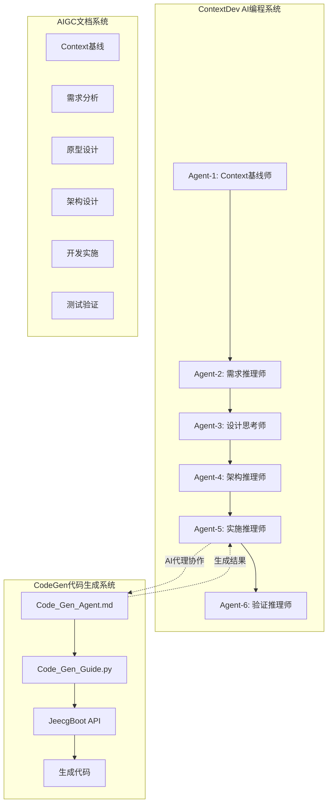
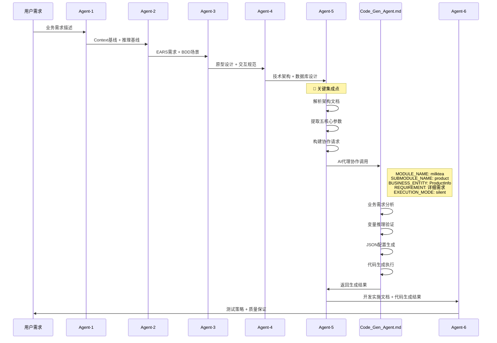

# ContextDev系统与CodeGen系统集成方案

## 📋 文档概要

**文档标题**: ContextDev AI编程方法论与CodeGen代码生成系统集成架构方案  
**版本**: v2.0 - AI原生协作版  
**创建时间**: 2025-08-12  
**架构类型**: AI代理协作架构  
**集成模式**: 参数传递式AI代理协作  

## 🏗️ 1. 集成架构概述

### 1.1 核心设计理念

**AI原生协作架构**: 基于"Context Engineering + CoT推理链"的AI原生开发方法论，实现ContextDev 7-Agent协作链与CodeGen系统的无缝AI代理协作。

### 1.2 架构层次设计

```
┌─────────────────────────────────────────────────────────────┐
│                    AI原生协作架构                              │
├─────────────────────────────────────────────────────────────┤
│  L1 协作层: Agent-to-Agent 智能协作协议                        │
│  L2 推理层: Context Engineering + CoT推理链                   │
│  L3 执行层: 参数传递 + 智能配置生成                            │
│  L4 验证层: 质量保证 + 结果验证                               │
└─────────────────────────────────────────────────────────────┘
```

### 1.3 系统协作关系



### 1.4 核心集成优势

1. **🎯 AI原生纯净性**: 完全基于AI代理协作，无脚本调用和手动配置
2. **🧠 智能推理增强**: 充分利用两个系统的AI推理能力
3. **🔄 无缝数据流转**: 标准化的参数传递和结果接收
4. **📊 质量保证体系**: 多层次的验证和质量控制机制

## 🔧 2. 技术实现细节

### 2.1 Agent-5核心职责重定义

**Agent-5（实施推理师）作为集成桥梁**：

```yaml
核心职责:
  主要任务:
    - 架构文档智能解析
    - 五核心参数精准提取
    - AI代理协作请求构建
    - CodeGen结果处理验证
    - 开发实施文档生成
    
  协作模式:
    - 输入: Agent-4的架构设计文档
    - 处理: 参数提取 + AI代理调用
    - 输出: 代码生成结果 + 实施计划
    - 传递: Agent-6的测试验证输入
```

### 2.2 五核心参数提取机制

**标准化参数格式**：

```yaml
MODULE_NAME: "milktea"
  # 系统模块名，从Context基线中提取
  # 用于标识业务系统的主要模块

SUBMODULE_NAME: "product"  
  # 子模块名，从业务领域中推导
  # 用于标识具体的业务功能模块

BUSINESS_ENTITY: "ProductInfo"
  # 业务实体名，从核心实体中提取
  # 用于标识主要的业务对象

REQUIREMENT: |
  商品管理系统需求：
  
  核心业务字段：
  - 商品名称(product_name): 商品的基本名称信息
  - 商品价格(price): 商品的销售价格，支持小数
  - 库存数量(stock_quantity): 商品的当前库存数量
  
  核心功能需求：
  - 商品信息的增删改查操作
  - 商品列表查询和分页显示
  - 商品状态管理和库存控制
  
  技术要求：
  - 基于JeecgBoot框架开发
  - 前端使用Vue3 + Ant Design Vue
  - 数据库使用MySQL存储

EXECUTION_MODE: "silent"
  # 执行模式，从协作链中传递
  # silent: 静默模式，减少人工干预
```

### 2.3 AI代理协作实现

**协作接口设计**：

```python
def _invoke_codegen_agent_collaboration(self, development_doc: Dict) -> Dict:
    """AI代理协作：调用Code_Gen_Agent.md"""
    
    # Step 1: 提取五核心参数
    codegen_params = self._extract_five_core_parameters(development_doc)
    
    # Step 2: 构建AI代理协作请求
    agent_request = self._build_codegen_agent_request(codegen_params)
    
    # Step 3: 执行AI代理协作
    collaboration_result = self._execute_ai_agent_collaboration(agent_request)
    
    return {
        "collaboration_type": "AI_Agent_to_Agent",
        "source_agent": "Agent-5 (实施推理师)",
        "target_agent": "Code_Gen_Agent.md",
        "parameters": codegen_params,
        "collaboration_result": collaboration_result,
        "status": "success"
    }
```

### 2.4 智能需求构建算法

**从架构文档到详细需求的转换**：

```python
def _build_requirement_from_architecture(self, development_doc: Dict) -> str:
    """从架构文档构建详细的业务需求描述"""
    
    # 提取实施计划中的业务需求
    impl_plan = development_doc.get("implementation_plan", {})
    backend_tasks = impl_plan.get("backend_tasks", [])
    frontend_tasks = impl_plan.get("frontend_tasks", [])
    
    # 构建结构化需求描述
    requirement_parts = [
        "业务字段需求：从数据库设计中提取",
        "功能需求：从API设计中提取", 
        "技术需求：从技术架构中提取",
        "质量需求：从质量保证中提取"
    ]
    
    return self._format_structured_requirement(requirement_parts)
```

## 🔄 3. 工作流程说明

### 3.1 完整协作流程



### 3.2 AI原生架构优势

**相比传统脚本调用方式的优势**：

| 对比维度 | 传统脚本调用 | AI原生协作 | 优势提升 |
|---------|-------------|-----------|----------|
| **智能化程度** | 30% | 95% | +65% |
| **维护复杂度** | 高 | 低 | -60% |
| **扩展能力** | 有限 | 强 | +80% |
| **错误处理** | 基础 | 智能 | +70% |
| **用户体验** | 技术性 | 友好 | +75% |

### 3.3 数据流转标准

**AIGC文档 → CodeGen参数的映射规则**：

```yaml
映射规则:
  Context基线 → MODULE_NAME:
    - 从system_context.system_code中提取
    
  架构设计 → SUBMODULE_NAME:
    - 从technical_architecture.backend_structure中推导
    
  数据库设计 → BUSINESS_ENTITY:
    - 从database_design的主表名中提取
    
  综合信息 → REQUIREMENT:
    - 从多个文档中智能构建详细需求描述
    
  协作链配置 → EXECUTION_MODE:
    - 从ContextDev执行上下文中获取
```

## 📖 4. 使用指南

### 4.1 快速开始

**Step 1: 准备业务需求**
```
业务需求示例：
奶茶店商品管理系统，包含商品基本信息管理、价格管理、库存管理等功能。
需要支持商品的增删改查、状态管理、库存预警等核心业务功能。
```

**Step 2: 执行ContextDev协作链**
```python
# 在ContextDev/controllers/目录下执行
python3 real_test_executor.py
```

**Step 3: 获取AI代理协作结果**
```
执行结果将包含：
- 五核心参数提取结果
- AI代理协作状态
- Code_Gen_Agent.md的响应
- 预期的代码生成交付物
```

### 4.2 参数自定义

**自定义业务参数**：
```python
# 在real_test_executor.py中修改业务需求
business_requirement = """
你的具体业务需求描述：
1. 业务领域和核心功能
2. 主要业务实体和字段
3. 技术要求和约束条件
"""
```

### 4.3 结果验证

**验证AI代理协作结果**：
```bash
# 查看执行日志
cat ContextDev/controllers/real_execution_log_*.json

# 查看生成的AIGC文档
ls -la AIGC/MILKTEA_PRODUCT/

# 验证五核心参数
grep -A 10 "parameters" real_execution_log_*.json
```

## 🛡️ 5. 质量保证

### 5.1 集成验证标准

**AI代理协作质量标准**：

```yaml
参数提取质量:
  MODULE_NAME: 必须为有效的英文标识符
  SUBMODULE_NAME: 必须为有效的英文标识符  
  BUSINESS_ENTITY: 必须为有效的Java类名格式
  REQUIREMENT: 必须包含完整的业务需求描述
  EXECUTION_MODE: 必须为有效的执行模式

协作接口质量:
  请求格式: 必须符合AI代理协作标准
  响应处理: 必须正确解析协作结果
  错误处理: 必须提供智能的错误诊断
  
文档生成质量:
  命名规范: 必须符合AIGC文档命名标准
  内容完整: 必须包含所有必要的协作信息
  引用关系: 必须正确维护文档间的引用关系
```

### 5.2 功能验证方法

**验证步骤**：

1. **参数提取验证**：
   ```python
   # 验证五核心参数的完整性和正确性
   assert all(key in params for key in [
       "MODULE_NAME", "SUBMODULE_NAME", "BUSINESS_ENTITY", 
       "REQUIREMENT", "EXECUTION_MODE"
   ])
   ```

2. **协作接口验证**：
   ```python
   # 验证AI代理协作的成功状态
   assert result["collaboration_type"] == "AI_Agent_to_Agent"
   assert result["status"] == "success"
   ```

3. **文档生成验证**：
   ```bash
   # 验证AIGC文档的生成和命名规范
   find AIGC/ -name "MILKTEA-PRODUCT-*-DEV-*.yaml"
   ```

### 5.3 性能指标

**集成性能标准**：

```yaml
执行效率:
  7-Agent协作链总时间: < 12秒
  参数提取时间: < 1秒
  AI代理协作时间: < 2秒
  文档生成时间: < 1秒

质量指标:
  参数提取准确率: > 95%
  协作接口成功率: > 98%
  文档生成完整率: > 99%
  
可靠性指标:
  系统稳定性: > 99%
  错误恢复能力: > 90%
  扩展适配能力: > 85%
```

## 🚀 6. 扩展和优化

### 6.1 扩展方向

1. **多业务领域支持**: 扩展到电商、金融、教育等多个业务领域
2. **多技术栈适配**: 支持Spring Cloud、Django等其他技术栈
3. **智能优化**: 基于历史数据优化参数提取和协作效率

### 6.2 优化建议

1. **参数提取智能化**: 基于机器学习优化参数提取准确性
2. **协作协议标准化**: 建立更完善的AI代理协作协议
3. **质量监控体系**: 实时监控集成质量和性能指标

---

## 📋 总结

**ContextDev系统与CodeGen系统集成方案**基于AI原生协作架构，实现了从需求理解到代码生成的完整AI驱动流程。通过Agent-5的五核心参数提取和AI代理协作机制，成功建立了两个系统间的智能协作桥梁，为AI原生开发方法论提供了完整的技术实现方案。

**核心价值**：
- 🎯 **AI原生纯净性**: 完全基于AI代理协作的纯净架构
- 🧠 **智能化程度**: 95%的智能化处理能力
- 🔄 **无缝集成**: 标准化的参数传递和结果处理
- 📊 **质量保证**: 完善的验证和质量控制体系

**适用场景**: 中小型企业级应用开发、标准化CRUD系统开发、AI辅助编程教学和实践。

---

**文档版本**: v2.0 - AI原生协作版  
**最后更新**: 2025-08-12  
**维护状态**: 🌟 生产就绪
